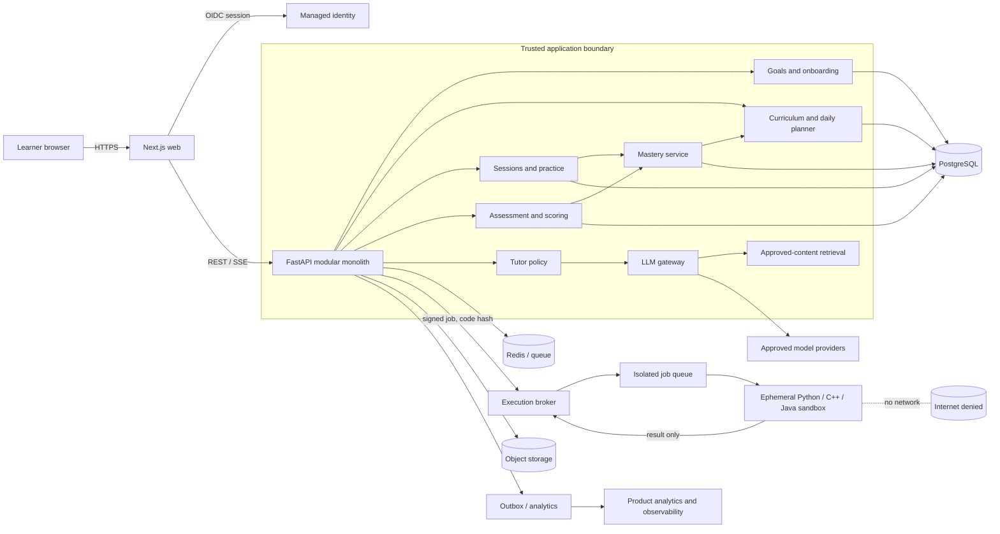
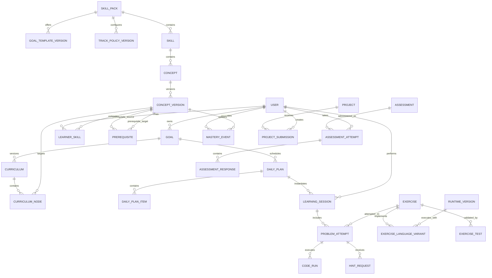
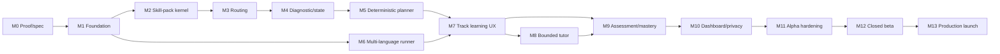

# Socrat V1 Product Requirements Document

**Status:** Implementation-ready draft  
**Date:** 2026-09-29  
**Owners:** Product, Engineering, Learning Design  
**Working product name:** Socrat  
**Launch product:** Personalized Data Structures and Algorithms preparation  
**Launch languages:** Python, C++, and Java  
**Target programs:** Beginner foundations, interview preparation, and competitive programming; duration and workload personalized by goal and baseline  

> Product contract: Socrat optimizes for demonstrated capability, not content consumption. A learner advances because they can perform, explain, retain, and transfer a skill—not because they watched or clicked through material.

## Assumptions and decisions

- V1 serves English-speaking adults (18+) who want to learn or improve DSA: complete programming beginners, learners preparing for software-engineering interviews, and competitive programmers. Each audience receives a different deterministic learning policy rather than the same course with different copy.
- The closed beta targets 100–300 learners. A small team can manually curate content, review AI output, and operate support.
- Web is the only client. Desktop and mobile apps are out of scope; the web experience is responsive but coding is optimized for laptop/desktop.
- Python, C++, and Java are first-class V1 languages. Concepts, mastery, and problem intent remain language-neutral; each released exercise has validated starter code, reference solutions, and tests for every supported language in which it is offered.
- V1 uses curated concept graphs, problems, rubrics, reference solutions, and tests. Deterministic models own eligibility, prerequisites, mastery, safety, assessment separation, and the default decisions for path selection, difficulty, review scheduling, workload, and adaptation. Language models may provide bounded, reviewable advice for curriculum or exercise choice when unstructured learner evidence matters, but they cannot bypass deterministic constraints or write learner state directly.
- DSA is the first published skill pack, not the product boundary. V1 must implement a domain-neutral learning engine and versioned skill-pack contract so the team can add courses and skills after launch without rewriting learner state, planning, assessment, or analytics infrastructure.
- “Mastery” is an operational product estimate with visible evidence and uncertainty, not a psychometric claim or credential.
- Delivery assumptions: 5–7 engineers plus product, design, learning/content, and part-time security/data support; approximately 24–30 weeks through gated beta/production milestones after a two-week concierge prototype; managed infrastructure where possible; no formal certification or proctoring in V1.

## 1. Executive Summary

Socrat V1 is an adaptive DSA learning product that converts a learner's goal—starting from zero, preparing for interviews, or improving competitive-programming performance—into a daily sequence of diagnosis, instruction, deliberate practice, independent assessment, retention checks, and curriculum adaptation. It does not lead with a course catalog or unrestricted tutor chat. The home screen presents one best next action; every action produces evidence about what the learner can do without help.

The V1 hypothesis is: **for adults learning DSA in Python, C++, or Java—from complete beginners to competitive programmers—a deterministic, evidence-driven practice loop with bounded Socratic support will improve independent performance on unseen, goal-calibrated DSA problems and sustain engagement better than a fixed self-study plan.**

The minimum proof is a 14-day controlled pilot, followed by a 4–8 week beta depending on track and baseline. The primary outcome is the change in independently verified competencies per active learner. The strongest counterfactual is not “no learning”; it is a fixed plan using the same curated content and practice inventory. Deterministic adaptation and Socratic help must earn their complexity by improving transfer, retention, and completion in each track.

V1 contains authentication, focused onboarding, goal clarification, track-aware adaptive diagnostics, a persistent learner model, a curated DSA graph with beginner and competitive extensions, daily plans, an in-browser Python/C++/Java workspace, guided hints, independent assessments, deterministic curriculum adaptation, and a progress dashboard. Other courses are not launch content, but the engine, data model, APIs, and authoring contract must support rapid publication of additional skill packs after DSA. V1 excludes social features, a marketplace, employment matching, broad certification, advanced proctoring, native apps, and autonomous coding agents.

## 2. Product Vision

### Near-term vision

Make technical self-study behave like a demanding, attentive coach: establish the destination, find the actual starting point, choose the next useful challenge, intervene without stealing the thinking, and demand proof before claiming progress.

### Exact V1 promise

> “Tell Socrat your DSA goal, preferred language, and schedule. Whether you are starting from zero, preparing for interviews, or training for contests, it will diagnose your current ability, give you a focused plan each day, coach you without immediately revealing answers, and show—using unseen independent tasks—which skills you can now demonstrate.”

The promise is measurable but not a guaranteed employment outcome. At program end, a learner receives:

- baseline vs. final independent solve rate on calibrated unseen problems at the selected track and difficulty;
- competency evidence for every concept in the learner's active DSA goal graph;
- hint-independent vs. assisted performance;
- seven-day retention results where available;
- completed problem history and one mini-project or applied challenge;
- a clear “ready / needs practice” map against the stated target.

### Long-term vision

The reusable engine is Goal → Diagnose → Plan → Learn → Practice → Assess → Adapt → Verify. DSA is the first skill pack, not a permanent category limit. The near-term company plan is to publish additional courses and skills as quickly as each can meet a defined quality bar: curated graph, valid practice, measurable assessment, safe tools, and retention evidence. Technical and professional skills follow first; broader domains follow when their capability can be observed. Permissioned competency verification and employer matching come later. Employment matching is an outcome of trustworthy evidence, not a V1 feature.

## 3. Problem

Learners have abundant explanations and problems but lack a reliable control loop. Fixed courses do not know what a learner already understands. Problem libraries expose large catalogs but make the learner choose sequence and difficulty. General chatbots can explain anything yet often give away the work, possess no defensible longitudinal learner state, and can confidently be wrong. The result is activity without reliable capability.

### Jobs to be done

1. When I have a DSA goal, tell me what capability it actually requires and whether my timeline is credible.
2. When I sit down to study, remove planning overhead and give me the highest-value next task.
3. When I am stuck, help me make progress while preserving the part I must learn to do independently.
4. When I feel progress, show evidence that it transfers to unfamiliar problems and persists over time.
5. When life interrupts, adjust the plan without pretending missed work was completed or creating an impossible backlog.

### Current alternatives and their gaps

- Videos and courses optimize the delivery and completion of content; proof of transfer is inconsistent.
- Problem banks optimize selection breadth and interview rehearsal; diagnosis, teaching, and prerequisite repair are usually learner-managed.
- General AI assistants optimize answer usefulness and speed; the incentive often conflicts with productive struggle.
- Bootcamps provide structure and accountability but are expensive, cohort-paced, and operationally heavy.
- Personal tutors can adapt well but are costly and variable.

### Why now

The market does not need another source of code answers. It needs a trust layer around AI assistance. In the 2025 Stack Overflow Developer Survey, 69% of respondents reported learning a new coding technique or language in the prior year, while more developers distrusted AI accuracy than trusted it. That combination supports a product built around practice evidence, constrained assistance, and validation rather than unrestricted generation.[^so2025]

## 4. Target Users

### Primary ICP

**An English-speaking adult learner who wants a structured, personalized path to DSA capability in Python, C++, or Java and is willing to practice rather than only consume explanations.** The launch does not assume one starting level. It supports three explicit goal tracks, each with its own deterministic policy and success measure:

1. **Start DSA from zero:** a complete programming beginner who needs language fundamentals, computational thinking, and gradual entry into data structures and algorithms.
2. **Prepare for coding interviews:** a student, self-taught developer, career switcher, or working developer targeting internship through experienced-hire interviews.
3. **Improve competitive programming:** a novice through advanced contestant targeting a platform rating band, contest division, topic set, speed, or consistency goal.

The learner owns a laptop/desktop with a modern browser, can commit at least 20 minutes on three days per week, selects one of the three supported languages, and accepts independent attempts as part of learning. Forty-five to 90 minutes on five days per week is recommended but not required.

### Initial subsegments

| Segment | Need | V1 fit |
|---|---|---|
| Complete beginner | Language fundamentals, computational thinking, and a safe ramp into DSA | Primary: Foundations track |
| Second/third-year CS student | Structure, coursework support, and interview readiness | Primary: Interview track |
| Self-taught junior developer | Fill DSA gaps and prove ability | Primary: Interview track |
| Career switcher | Language primer plus guided prerequisites and practice | Primary: Foundations or Interview placement |
| Experienced developer refreshing DSA | Efficient gap-based plan | Primary: Interview accelerated policy |
| Novice competitive programmer | Topic coverage, pattern recognition, contest habits | Primary: Competitive track |
| Intermediate/advanced competitive programmer | Rating-specific gaps, speed, mixed contests, post-contest repair | Primary, subject to released difficulty inventory |

### Disqualifying conditions

The onboarding should say “this beta is not the right fit yet” only when the learner wants an unsupported language, wants only answer generation, cannot make the minimum practice commitment, or targets concepts/difficulty for which the published DSA pack lacks sufficient validated content. Complete beginners must not be rejected for low baseline knowledge; they enter the Foundations track. Advanced competitive programmers may enter only if their target rating/topic coverage is marked released. Otherwise, show the precise coverage gap and invite them to a waitlist rather than inventing content.

## 5. Core Hypothesis

### Primary hypothesis

Among qualified learners in each launch track and language, Socrat produces a greater program-period increase in **independent solve rate on calibrated unseen DSA problems** than a fixed curriculum using the same content, without reducing completion. Results must be reported separately for Foundations, Interview, and Competitive cohorts and for Python, C++, and Java; an aggregate win cannot hide a failing segment.

### Testable decomposition

- **H1—Diagnosis:** skill-aware placement reduces redundant practice and prerequisite failures.
- **H2—Adaptation:** deterministic selection of tasks, difficulty, workload, and review timing from learner evidence improves independent solve rate compared with a fixed sequence.
- **H3—Socratic support:** staged hints improve eventual independent performance compared with immediate explanations.
- **H4—Accountability:** a bounded daily commitment and missed-day replanning improve D7 and program completion.
- **H5—Value:** qualified learners will pay for continued adaptive practice after seeing baseline and week-one evidence.

### Falsification thresholds

Do not scale content or domains if, in a sufficiently powered beta:

- the adaptive cohort improves by less than 10 percentage points more than the fixed-plan cohort on unseen independent problems;
- fewer than 35% of activated users complete four sessions in week one;
- fewer than 25% of activated users remain active in week four;
- more than 5% of released exercises contain a material correctness or ambiguity issue;
- the tutor reveals a full solution before permitted escalation in more than 3% of audited practice conversations.

Thresholds are initial operating decisions, not industry benchmarks. Revisit them after the concierge pilot establishes variance and sample-size needs.

## 6. Product Principles

1. **Capability over consumption.** Completion changes scheduling, not mastery.
2. **Think before help.** The tutor first elicits a learner attempt and preserves productive struggle.
3. **Adaptive path, deterministic authority.** Versioned rules and statistical models own prerequisites, placement, mastery, safety, and progression. An LLM may advise among already eligible curriculum or exercise options, but the policy engine validates and applies the final decision.
4. **Measure, do not trust claims.** Self-report informs the prior; behavior updates it.
5. **Assistance must not erase evidence.** Assisted and independent work are stored and scored separately.
6. **One clear next action.** No infinite course catalog or blank chat as the primary surface.
7. **Uncertainty is visible.** Show “limited evidence” instead of false precision.
8. **Recovery over punishment.** Missed work triggers replanning, never shame or artificial scarcity.
9. **Human-reviewable decisions.** Store the inputs, deterministic policy/model version, and reason for every material adaptation.
10. **DSA first, platform-ready from day one.** Ship one high-quality DSA skill pack in V1 while keeping core entities, services, and UI language domain-neutral so new courses do not require a rewrite.

## 7. V1 Scope

### Must have

| Capability | V1 boundary | Why it is required |
|---|---|---|
| Authentication | Email magic link or OAuth; adult consent | Persistent learner state |
| Onboarding and goal | Three DSA goal tracks, supported language, target, deadline, and schedule | Defines the optimization target and policy |
| Adaptive diagnostic | Track- and language-aware staged diagnostic; early stop | Establishes evidence-based placement, including zero-baseline learners |
| Learner model | Per-concept mastery, confidence, retention, misconceptions, help dependency | Enables adaptation |
| Skill-pack framework | Domain-neutral course/graph/version contract; DSA is first published pack | Enables rapid, safe expansion after launch |
| DSA skill graph | Language fundamentals plus beginner-to-competitive concepts and prerequisite edges | Supports all three V1 learner types |
| Curriculum | Goal-specific DAG instance with rationale and version | Creates an auditable path |
| Daily plan | 20/30/45/60/90-minute variants; one primary action | Supports beginners through contest practice |
| Learning blocks | Concise concept cards and worked-example fading | Supports gaps without building a course library |
| Practice | Curated internal/licensed problems and deterministic selection | Produces capability evidence |
| Python/C++/Java workspace | Monaco, language templates, compile/run/test/submit, errors | Measures practical work in the learner's chosen language |
| Socratic tutor | Context-bound hint ladder and solution gate | Helps without replacing thought |
| Assessment | Independent weekly and final assessment | Separates learning from verification |
| Adaptation | Rule engine changes tasks/order/workload | Tests the core hypothesis |
| Dashboard | Goal, today, evidence, weak areas, trajectory | Makes progress legible |
| Product analytics | Exposure, attempt, hint, submit, mastery, retention events | Makes experiments possible |

### Should have, behind flags

- spaced-repetition reviews after days 2, 7, 14, and 30;
- one mini-project/applied problem set;
- email/browser reminders with quiet hours;
- one external problem provider using links and metadata, subject to terms;
- weekly assessment and schedule review;
- curated resource recommendations;
- problem-quality admin console and human review queue.

### Explicitly not V1

- published course content beyond the DSA skill pack (the engine and authoring contract must remain course-agnostic);
- languages beyond Python, C++, and Java, or arbitrary packages/runtimes;
- non-DSA language courses as standalone launch products; V1 teaches only the language fundamentals required to enter DSA;
- children’s accounts or school administration;
- social feed, peer chat, cohorts, public leaderboards;
- creator or course marketplace;
- employment matching, company profiles, or applicant ranking;
- blockchain credentials or formal industry certification;
- webcam proctoring, lockdown browser, or “AI cheating detector”;
- native mobile apps, full cloud IDE, repository hosting, or pair programming;
- autonomous coding agents, arbitrary web browsing, or dozens of integrations;
- fully generated problem inventory or open-ended curriculum generation;
- unsupported elite competitive topics until the released content inventory and assessment bank meet the quality gate.

## 8. User Journey

### 8.1 Acquisition and qualification

Landing page promise: “Learn DSA from your actual level—and prove what you can solve independently.” A short eligibility and routing check precedes signup: goal track, target, deadline, language, baseline, and weekly availability. It routes beginners, interview learners, and competitive programmers to different diagnostics and deterministic policies.

### 8.2 Focused onboarding

| Question | Input | Product reason |
|---|---|---|
| What outcome are you targeting? | Start from zero / interview prep / competitive programming / custom text | Select goal template and track policy |
| Target date? | Date or “no fixed date” | Calculate feasible pace and warn, not promise |
| Preferred language? | Python / C++ / Java | Select content variants, compiler/runtime, and syntax diagnostic |
| Programming experience in that language? | None / syntax only / solved problems / used professionally | Select diagnostic stage; never reject a beginner |
| DSA experience? | Never / studied / inconsistent practice / comfortable | Diagnostic start difficulty only |
| Interview or contest target? | Role/level/company pattern or platform/rating/division/topic | Select competency thresholds and assessment blueprint |
| Time commitment? | Days/week and 20/30/45/60/90 min | Daily-plan budget |
| Preferred study days/time zone | Schedule | Plan dates and reminders |
| Why now? | Optional short text + preset | Personal milestone copy; not scoring |
| Learning preference? | Read concise explanation / worked example / visual trace | Tie-breaker for representation, never exemption from practice |

No personality tests, exhaustive biographies, demographic profiling, or self-rated concept grids.

### 8.3 Goal clarification

The system maps structured inputs and optional free text to one of three versioned goal templates:

- **Foundations:** “By `{target_date}`, write and debug programs in `{language}`, implement core data structures, solve at least `{threshold}` of calibrated beginner DSA problems independently, and explain correctness and basic complexity.”
- **Interview:** “By `{target_date}`, independently solve at least `{threshold}` of a calibrated unseen interview set at `{target_level}`, covering the required patterns; explain approach and complexity; complete timed mixed assessments.”
- **Competitive:** “By `{target_date}`, achieve the released competency profile for `{platform/rating_or_division}`, including topic coverage, solve speed, contest simulation, and post-contest correction.”

Clarifying questions are asked only when a required field is unresolved: track, target level/rating or foundation outcome, target date, time budget, or supported language. A structured deterministic form is authoritative; an optional language model may parse free text into proposed fields plus `ambiguities[]` but never creates unsupported outcomes. The user confirms the measurable goal before diagnosis.

### 8.4 Diagnostic

The diagnostic is staged. A zero-baseline learner receives a low-anxiety 10–15 minute computational-thinking and language-readiness diagnostic; inability to code is a valid placement, not failure. Learners with experience receive a 25–45 minute adaptive diagnostic. Competitive learners add speed, topic breadth, and contest-history evidence where connected or self-entered, but self-report never becomes mastery. Each diagnostic begins at a track-appropriate information-value point, adapts difficulty and prerequisite branches, and stops when additional items are unlikely to change placement. Results show bands and confidence/evidence counts, not fake precision.

### 8.5 Plan review

Socrat presents the first two weeks in detail and later weeks as milestones. It explains three placement decisions, flags an unrealistic target if applicable, and lets the learner reduce workload or shift the date. Learners cannot manually mark concepts mastered; they can challenge placement by taking an assessment.

### 8.6 Daily loop

1. Open “Today” and see time, purpose, and next milestone.
2. Complete a 2–5 minute retrieval warm-up when due.
3. Learn or revisit one concept in a 5–12 minute block.
4. Attempt guided practice with staged hints.
5. Attempt at least one independent challenge with direct solutions locked.
6. Complete a short exit check and confidence reflection.
7. Receive the next scheduled session and a concise explanation of adaptation.

### 8.7 Weekly and final loop

Every seven active days or calendar week, the learner completes a 25–40 minute mixed independent assessment. The system re-estimates mastery, repairs prerequisites, and replans. The final assessment uses unseen items, fixed time limits, no tutor, randomized variants, and an explanation question. Results compare against baseline and identify the next honest step.

### 8.8 Missed-day recovery

On return, ask: “How much time do you have today?” Then reschedule by priority. Never stack all missed tasks. Preserve milestone requirements, drop redundant exposure, and shift the target or lower weekly scope when capacity is mathematically insufficient.

## 9. Feature Requirements

### Requirement template

Every feature specification uses: **Problem → User value → Implementation → Dependencies → Failure modes → Priority.** Details below are normative for V1.

### F-01 Authentication and profile

- **Problem:** learning evidence must persist securely across sessions.
- **User value:** resume exactly where work stopped and control personal data.
- **Implementation:** managed OAuth/magic link; session rotation; profile with time zone, locale, age confirmation, reminder consent, and deletion/export controls.
- **Dependencies:** identity provider, PostgreSQL, transactional email.
- **Failure modes:** duplicate identities, stale sessions, accidental minor enrollment, account enumeration.
- **Priority:** Must.

### F-02 Goal and onboarding

- **Problem:** vague intent cannot drive measurable adaptation.
- **User value:** a feasible, explicit target with a daily commitment.
- **Implementation:** supported goal template plus structured clarification; save raw statement, normalized objective, deadline, schedule, and version.
- **Dependencies:** goal schema, template registry, structured LLM output.
- **Failure modes:** invented promises, excessive questions, unsupported goal silently accepted.
- **Priority:** Must.

### F-03 Diagnostic

- **Problem:** fixed placement wastes time and hides prerequisite gaps.
- **User value:** start at the right point with visible evidence.
- **Implementation:** curated item bank tagged by concept, difficulty, discrimination proxy, format, and expected time; rule-based next-item selection; assessment-mode sandbox.
- **Dependencies:** skill graph, item bank, scoring service, workspace.
- **Failure modes:** item leakage, fatigue, lucky multiple choice, environment issues mistaken for low skill.
- **Priority:** Must.

### F-04 Learner state and adaptation

- **Problem:** events are useless unless converted into stable decisions.
- **User value:** work changes when evidence changes.
- **Implementation:** append-only evidence events; deterministic mastery updater; misconception flags; nightly/on-submit replanning; explainable decision codes.
- **Dependencies:** event model, mastery service, scheduler.
- **Failure modes:** oscillating plans, overreaction to one failure, hidden model changes.
- **Priority:** Must.

### F-05 Learning and practice session

- **Problem:** learners need an executable session, not a resource list.
- **User value:** a clear bounded path from explanation to independent work.
- **Implementation:** state machine `planned → started → block_active → submitted → completed/abandoned`; autosave; resume; visible time estimate; no infinite scroll.
- **Dependencies:** daily plan, content, workspace, tutor.
- **Failure modes:** lost code, inaccurate duration, too many context switches.
- **Priority:** Must.

### F-06 Socratic help

- **Problem:** direct answers create completion without learning.
- **User value:** unblock while retaining ownership of the solution.
- **Implementation:** learner selects “I’m stuck”; service receives problem/rubric, code, test results, prior hints, concept state, and allowed hint ceiling; structured hint response; full solution requires explicit escalation and is disabled in independent mode.
- **Dependencies:** LLM gateway, prompt registry, policy engine, observability.
- **Failure modes:** answer leakage, incorrect diagnosis, repetitive questions, patronizing tone.
- **Priority:** Must.

### F-07 Coding workspace

- **Problem:** practical ability cannot be measured in passive content.
- **User value:** write, run, debug, and submit without setup friction.
- **Implementation:** Monaco editor; Python runtime in disposable isolated jobs; sample tests, custom stdin, submit action, stderr/stdout, execution status, attempt history; no terminal or package install.
- **Dependencies:** execution API, job queue, sandbox workers, object/log storage.
- **Failure modes:** resource abuse, queue latency, flaky tests, test leakage.
- **Priority:** Must.

### F-08 Assessment

- **Problem:** practice performance is contaminated by hints and familiarity.
- **User value:** trustworthy proof of independent capability.
- **Implementation:** timed mixed forms, no tutor, unseen/low-exposure items, code + explanation + tracing/debugging, server tests, rubric scoring, manual review queue for uncertain qualitative scores.
- **Dependencies:** assessment forms, workspace, scoring, mastery.
- **Failure modes:** memorized item, model misgrading, accessibility conflicts, cheating.
- **Priority:** Must.

### F-09 Dashboard and accountability

- **Problem:** learners cannot act on a generic progress bar.
- **User value:** know today’s action, current evidence, weak areas, feasibility, and next milestone.
- **Implementation:** Today card, goal trajectory, competency map, evidence drawer, weekly trend, schedule control, recovery flow, optional reminder.
- **Dependencies:** read models, scheduler, analytics.
- **Failure modes:** false precision, shame-inducing missed-day copy, clutter.
- **Priority:** Must; reminders Should.

### 9.1 Detailed user stories

1. As a learner, I want to choose a foundations, interview, or competitive goal so the program can define a measurable outcome that matches my reason for learning DSA.
2. As a learner with an unrealistic deadline, I want an honest feasibility warning and alternatives so I do not receive a false promise.
3. As a Python, C++, or Java learner, I want my real language and DSA ability tested so I do not repeat skills I already know.
4. As a learner with prerequisite gaps, I want those gaps found before harder work so repeated failure has a useful remedy.
5. As a busy learner, I want a 30-, 45-, or 60-minute plan so the session fits the commitment I actually made.
6. As a returning learner, I want one obvious next action so I do not spend energy browsing content.
7. As a learner, I want concise explanations tied to the problem I am about to solve so study remains purposeful.
8. As a visual learner, I want trace tables and state diagrams where they clarify an algorithm, without avoiding implementation practice.
9. As a stuck learner, I want the tutor to inspect my current reasoning and code so the hint addresses my actual obstacle.
10. As a learner, I want hints to escalate gradually so I can recover with the least assistance necessary.
11. As a learner, I want a full explanation eventually in learning mode so a dead end does not become permanent confusion.
12. As a learner in an independent challenge, I want solution access delayed until submission so the result remains meaningful.
13. As a learner, I want compiler/runtime errors explained without the system rewriting my whole answer.
14. As a learner, I want repeated misconceptions remembered so future practice targets the cause rather than only the topic.
15. As a learner who improves quickly, I want redundant tasks skipped after proof so the program respects my time.
16. As a learner who struggles, I want difficulty reduced and prerequisites revisited so challenge remains attainable.
17. As a learner, I want old skills resurfaced after a delay so I learn whether I retained them.
18. As a learner, I want weekly unseen assessments so I can distinguish recognition from independent ability.
19. As a learner, I want assisted and independent performance shown separately so my progress is honest.
20. As a learner, I want to inspect the evidence behind a competency status so a score is not mysterious.
21. As a learner who misses days, I want a realistic recovery plan so I can resume without an accumulated debt wall.
22. As a learner, I want to adjust reminder time and quiet hours so accountability remains respectful.
23. As a learner, I want a mini-project or applied set so I can connect isolated techniques into a larger solution.
24. As a learner, I want my final result compared with my baseline so I can see actual change.
25. As a privacy-conscious learner, I want to export and delete my data and understand how model providers handle it.
26. As a content operator, I want to quarantine a broken problem immediately so no additional learners receive it.
27. As a learning designer, I want to inspect why a plan changed so I can audit adaptation quality.
28. As a support operator, I want replayable execution and tutor metadata without exposing unnecessary personal information.
29. As a complete beginner, I want to begin with computational thinking and language basics without being rejected or dropped into algorithm problems I cannot parse.
30. As a competitive programmer, I want practice selected by topic, rating/difficulty, speed, and wrong-submission patterns so the plan targets contest performance rather than interview behavior.
31. As a learner, I want the same competency evidence to remain meaningful if I solve in Python, C++, or Java, while language-specific errors are remediated separately.
32. As a content author, I want to publish a future skill pack through stable graph, content, assessment, and mastery contracts without changing the core platform.

## 10. Learner Model

### 10.1 State representation

The learner model is a set of versioned, evidence-backed state records, not one global level.

For each learner × concept, store:

- `mastery_mean` in [0,1]: estimated current performance probability under target conditions;
- `confidence` in [0,1]: sufficiency and diversity of evidence;
- `retention_factor` in [0,1]: time-sensitive evidence of persistence;
- `independent_rate` and `assisted_rate`;
- evidence counts by type, difficulty, recency, and novelty;
- misconception codes and last observed timestamp;
- median solve time relative to calibrated expectation;
- hint count, maximum hint level, and first-hint latency;
- learning velocity: rolling change in mastery per active hour, shown only internally until stable;
- preferred difficulty: the level producing roughly 65–80% success in learning mode;
- due dates for retrieval and reassessment;
- model version and last decision reasons.

At learner level, store schedule adherence, abandonment pattern, workload tolerance, tutor dependency trend, accessibility preferences, and goal feasibility. These may alter pacing but cannot inflate mastery.

### 10.2 Evidence taxonomy

| Evidence | Base weight | Independence multiplier | Notes |
|---|---:|---:|---|
| Passive view/completion | 0 | n/a | Never updates mastery |
| Retrieval short answer | 0.5 | 1.0 | Good for recall, limited transfer |
| Guided exercise | 0.7 | 0.4–0.9 | Multiplier falls with hint level |
| Independent implementation | 1.2 | 1.0 | Must pass hidden tests |
| Debugging/tracing item | 0.8 | 1.0 | Adds evidence diversity |
| Explanation/rationale | 0.8 | 1.0 | Rubric score; uncertain cases reviewed |
| Weekly unseen assessment | 1.8 | 1.0 | Highest V1 evidence weight |
| Retention check ≥7 days | 1.5 | 1.0 | Updates retention and mastery |
| Project rubric criterion | 1.2 | 0.6–1.0 | Lower if assistance was extensive |

### 10.3 Update method

Use a weighted Beta-Bernoulli heuristic per concept. Initialize curated priors by diagnostic branch (default `α=2, β=2`). For scored evidence `s ∈ [0,1]` with effective weight `w`:

```text
alpha' = alpha + w * quality * s
beta'  = beta  + w * quality * (1 - s)
mastery_mean = alpha' / (alpha' + beta')
confidence = min(0.95, diversity_factor * (1 - exp(-(alpha' + beta' - 4) / 8)))
effective_mastery = mastery_mean * retention_factor
```

`quality` accounts for item calibration and execution reliability. `diversity_factor` rises when evidence spans implementation, explanation/debugging, assessment, and delayed recall; repeated near-duplicate items cannot manufacture confidence. A hint multiplier is `1.0, .85, .70, .50, .30, .10` for levels 0–5. Failures are not down-weighted because a hint was absent.

This method is deliberately simple, inspectable, and replaceable. The parameters are configuration, versioned with every `MasteryEvent`. Later, calibrated item response or Bayesian knowledge tracing models may be tested only against better predictive validity.

### 10.4 Misconceptions

Misconceptions use a controlled taxonomy such as `binary_search_boundary`, `complexity_nested_loop`, `mutation_during_iteration`, `dfs_missing_visited`, and `base_case_incomplete`. Deterministic test signatures create high-confidence flags; the tutor may propose a flag with rationale, but only approved labels are stored. Flags decay after two independent counterexamples and one delayed success.

### 10.5 Example transition

For recursion, prior `Beta(2,3)` yields 0.40 with low confidence. A failed independent base-case item (`s=.2,w=1.2`), a level-2-assisted trace (`s=.8,w=.49`), an independent implementation (`s=1,w=1.2`), and an assessment score of .72 (`w=1.8`) yield an updated estimate near the developing/capable boundary, with moderate—not high—confidence. The decision engine assigns two targeted exercises and defers backtracking. Exact UI wording is “Developing; evidence from 4 activities,” not “58% mastered.”

### 10.6 Update timing and safeguards

- Append raw evidence immediately and update state transactionally after a scored event.
- Replan the remaining day only after a hard blocker or explicit learner request; otherwise apply changes to the next day to avoid a moving target.
- Cap a single event’s mastery change at 0.15.
- Require two independent pieces of evidence before a concept can move two bands.
- Log `before`, `after`, configuration version, and reason codes.
- If scoring is uncertain or a runner incident occurs, store the attempt but set evidence quality to zero pending review.

## 11. Skill Graph

### 11.1 V1 graph

The graph is a versioned directed acyclic graph. Nodes represent observable competencies, not chapters. Edges mean “reliable performance on A is normally required before B.” The DSA pack has a language-neutral core plus three overlays: language foundations, interview patterns, and competitive-programming extensions.

```text
Language foundations (Python | C++ | Java adapter)
├─ Variables, I/O, conditions, loops, functions
├─ Collections, strings, mutation/value semantics
├─ Debugging, testing, code tracing ───────────────┐
└─ Recursion/call stack basics ────────────────────┤
                                                   v
Core DSA
├─ Complexity foundations ────────────> Binary search
├─ Arrays and strings ────────────────> Two pointers / sliding window
│  └─ Hash maps and sets ─────────────┘
├─ Stack / queue ─────────────────────> BFS
├─ Linked structures ─────────────────> Linked lists
└─ Recursion ─────────────────────────> Tree traversal ──> Graph BFS/DFS

Interview overlay: pattern recognition, explanation, trade-offs, timed mixed sets
Competitive overlay: math/number theory, prefix/difference techniques, greedy,
DSU, shortest paths, advanced trees, dynamic programming, contest strategy,
speed/accuracy calibration (released incrementally by validated difficulty band)

Cross-cutting: problem decomposition, debugging, correctness reasoning,
complexity analysis, explanation, and test-case design.
```

Launch coverage must include language readiness for Python, C++, and Java; the core nodes above; the primary interview overlay; and competitive-programming content through the explicitly published rating/difficulty ceiling. Advanced nodes may exist in draft but cannot be scheduled until their exercises and assessment forms are released.

### 11.2 Concept contract

Each `ConceptVersion` must contain:

- stable key, name, scope, exclusions, and observable learning objectives;
- skill-pack and optional track overlay; language-neutral intent plus supported language adapters;
- prerequisite edges with minimum effective mastery;
- approved explanations, examples, misconceptions, and representations;
- exercise and assessment coverage targets by type and difficulty;
- mastery criteria and retention schedule;
- goal relevance weights and expected learning time;
- author, reviewer, publication status, and change log.

### 11.3 Skill-pack and authoring model

The platform contract is domain-neutral: `SkillPack → GoalTemplates → Concepts/Edges → Content/Tools → ExerciseTypes → AssessmentBlueprints → MasteryPolicy → TrackPolicies`. The first published pack is DSA. Adding a later course should require a new pack and relevant tool adapters, not new user, learner-state, planning, scheduling, or analytics systems.

Truth is curated. A learning designer or domain expert authors the graph and outcome rubric. Models may draft descriptions, tag candidate resources, generate variants in quarantine, and suggest missing edges. Nothing becomes active until schema validation, automated checks, and human approval. Runtime curriculum generation may select and order approved nodes; it cannot create new published nodes or prerequisite edges.

### 11.4 Versioning

Published graph versions are immutable. A goal and curriculum pin a graph version. Material changes create a migration proposal: map old nodes to new, recalculate only derived state, preserve raw evidence, and never silently erase learner history.

## 12. Curriculum Engine

### 12.1 Inputs and output

**Inputs:** normalized goal and track, supported language, target difficulty/rating band, target date, daily time budget, graph version, learner state, content availability, due reviews, and operational constraints.  
**Output:** a versioned curriculum DAG plus the next 7–14 daily plans, milestone dates, feasibility status, and reason codes.

### 12.2 Deterministic planner

1. Resolve target competencies and threshold from the goal template.
2. Calculate the prerequisite closure.
3. Remove only nodes with sufficient effective mastery and confidence; schedule retention evidence instead.
4. Assign a need score:

```text
need = goal_relevance
     * (1 - effective_mastery)
     * prerequisite_blocking_factor
     * uncertainty_factor
     * retention_urgency
```

5. Topologically sort eligible nodes. Use need score, due-date risk, content diversity, and time fit as tie-breakers.
6. Allocate each session: retrieval (5–10%), instruction (10–20%), guided practice (25–35%), independent practice (35–50%), exit check (5–10%).
7. Reserve 20% weekly capacity for repair/review and one assessment block.
8. Run feasibility: compare estimated required minutes with available minutes. Return `on_track`, `at_risk`, or `date_unfeasible` with options.

The deterministic planner is the mandatory baseline and must be capable of operating the entire product without an LLM. A bounded LLM advisor may be invoked when the deterministic selector has several similarly ranked eligible choices or when free-form learner reasoning reveals a likely misconception not captured by structured events. It may recommend a path adjustment or rank a small approved candidate set. It may not create a published concept/problem, bypass a prerequisite, select a sequestered assessment item, exceed time/difficulty policy, change mastery, or determine assessment eligibility.

### 12.3 Constrained LLM advisory flow

```text
Deterministic eligibility and safety filters
  → deterministic baseline score and top 3–8 approved candidates
  → optional LLM recommendation with evidence and candidate IDs
  → schema, citation, policy, exposure, and feasibility validation
  → deterministic accept/reject/fallback decision
  → versioned decision log and outcome evaluation
```

Invoke the advisor only for configured cases: ambiguous free-form reflection, a repeated unexplained failure, multiple near-equal remediation options, or a custom goal that maps to more than one released path. Its output must include `recommended_candidate_ids`, `evidence_refs`, `reason_codes`, and `confidence`. If it returns an unknown ID, unsupported rationale, low confidence, timeout, or policy violation, use the deterministic baseline.

The advisor launches in shadow mode: record what it would choose without affecting the learner. Enable it for a canary cohort only if offline experts prefer its choices and an online experiment shows better subsequent independent performance than the deterministic baseline without increasing abandonment, content defects, latency, or cost. If it adds no measurable learning value, keep it disabled.

### 12.4 Deterministic track policies

All learners share the same evidence and prerequisite engine, but policy configuration differs by goal type:

| Policy dimension | Foundations / complete beginner | Interview preparation | Competitive programming |
|---|---|---|---|
| Entry behavior | Computational-thinking and language micro-diagnostic; no coding assumed | Test language fluency and core DSA; skip proven basics | Test topic breadth, speed, implementation reliability, and target-band prerequisites |
| Early session mix | 20–30% concept/example, 35–45% guided, 20–30% independent | 10–20% concept, 25–35% guided, 35–50% independent | 5–15% repair, 55–75% timed independent/mixed practice, 10–20% upsolving |
| Target success zone | 75–85% in learning mode to protect early self-efficacy | 65–80% | 50–70% during stretch practice; higher in consolidation |
| Difficulty controller | Step size ≤1; require language readiness before DSA implementation | Pattern and difficulty band; raise after diverse independent success | Rating/difficulty delta, solve time, wrong-submission rate, topic coverage, contest recency |
| Assessment | Small programs, traces, core implementation, explanation | Unseen interview problems and written reasoning | Timed virtual contest, per-problem results, penalty/wrong attempts, post-contest upsolve |
| Primary outcome | Independent implementation and core DSA readiness | Unseen solve rate, correctness, complexity explanation | Rating-band competency, speed/accuracy, contest performance trend |
| Recovery | Shorter blocks and prerequisite repair | Preserve milestone and mixed sets | Post-contest error classification and targeted drills |

Track assignment is deterministic from the confirmed goal plus diagnostic state. Policy changes require a versioned configuration rollout and cohort analysis; an LLM cannot switch a learner's track.

### 12.5 Adaptation rules

| Trigger | Required response | Guardrail |
|---|---|---|
| Two failures on same misconception | Insert micro-lesson + targeted problem | No more than one detour per session |
| Independent score <0.4 twice | Step down difficulty or prerequisite check | Preserve goal; do not label learner |
| Success ≥0.85 on two diverse independent items | Skip redundant guided item | Still schedule delayed recall |
| Level 4–5 hint on >40% of last 5 tasks | Add no-solution challenge and lower novelty | Explain as independence practice, not punishment |
| Solve time >2× expected with correct result | Keep difficulty, teach strategy/recognition | Do not mark as failure |
| Three fast correct items at current difficulty | Raise difficulty one band | Maximum one-band jump |
| Retention check fails | Reopen concept and prerequisite diagnostic | Do not erase prior accomplishment |
| Missed ≥2 planned days | Recompute workload and milestone date | Never create backlog debt |
| Beginner hits three syntax-only compile failures | Insert a language micro-skill and scaffolded repair | Do not interpret syntax friction as DSA failure |
| Competitive learner is correct but slower than target | Add speed drill and pattern-recognition review | Do not lower conceptual mastery |
| Competitive learner repeats wrong submissions | Add counterexample/test-design practice | Track accuracy separately from topic mastery |

### 12.6 Curriculum change policy

Store each revision with added/removed/moved nodes and reason codes. The UI shows a one-sentence explanation: “Binary search moved to Thursday because today’s complexity assessment showed a prerequisite gap.” Learners may choose a lighter day or reschedule; they may not force an unverified mastery state.

## 13. Daily Learning Engine

### 13.1 Session anatomy

For a 45-minute day:

| Block | Typical time | Mode | Evidence |
|---|---:|---|---|
| Retrieval | 4 min | Independent | Recall/retention |
| Concept or worked example | 7 min | Learning | None from viewing |
| Guided problem | 12 min | Hints available | Assisted evidence |
| Independent challenge | 17 min | No solution; limited clarification | Primary mastery evidence |
| Exit explanation | 4 min | Independent | Conceptual evidence |
| Plan confirmation | 1 min | Reflection | Scheduling only |

Thirty-minute sessions keep retrieval, one concise explanation if needed, one primary problem, and exit check. Sixty-minute sessions add a second diverse problem rather than a longer lecture.

### 13.2 State machine

`scheduled → available → started → in_progress → completed | abandoned | expired`.

Each block has `locked`, `available`, `in_progress`, `submitted`, `skipped`, `failed_operationally`. Content unlock is deterministic. Assessment blocks never accept tutor messages. A learner can pause a normal block; timed assessments continue except for approved accommodations.

### 13.3 Dynamic behavior

- Struggling: shorten exposition, render a concrete trace, reduce one difficulty band, isolate the misconception, then retry with a structurally different task.
- Progressing quickly: omit worked example, raise novelty/difficulty, require explanation, and schedule delayed transfer.
- Fatigued/time-limited: preserve one independent attempt and due retrieval; defer optional concept material.
- Frustrated: offer a choice between a prerequisite refresher and a simpler analogous problem. Never offer “show answer” as the first escape.
- Operational failure: preserve code, mark the attempt unscored, offer retry, and exclude the event from mastery.

### 13.4 Reflection

The exit prompt is one tap plus an optional sentence: “What made this problem difficult?” Choices map to controlled signals: concept gap, pattern recognition, implementation bug, complexity, unclear prompt, time pressure. Reflection does not directly change mastery but informs the next task and content-quality review.

## 14. Socratic Tutor

### 14.1 Behavioral contract

The tutor’s objective is the smallest intervention that enables the learner’s next reasoning step. It is scoped to the active concept and problem, cannot browse freely, cannot modify submissions, and must cite the relevant code line or stated reasoning when diagnosing an error.

### 14.2 Hint ladder

| Level | Behavior | Example | Evidence multiplier |
|---|---|---|---:|
| 0 | Elicit current reasoning | “What have you tried, and where does it stop matching the example?” | 1.00 |
| 1 | Targeted question | “Which values must be remembered as you scan?” | .85 |
| 2 | Conceptual hint | “A set can answer whether a value has appeared in constant average time.” | .70 |
| 3 | Technique direction | “Track complements in a hash map as you make one pass.” | .50 |
| 4 | Partial scaffold | Pseudocode with a missing core condition | .30 |
| 5 | Full walkthrough/solution | Explanation and reference solution after an attempt | .10 |

Learners can request escalation. The tutor may skip upward only when the user reports an accessibility issue, the problem is found defective, or two lower-level interventions failed. In an independent challenge, levels 4–5 are locked until submission or timeout; assessment mode disables all hints.

### 14.3 Request pipeline

1. Policy service determines mode, maximum level, and whether an attempt is required.
2. Context builder retrieves only the active problem, approved concept excerpts, learner code/test output, recent hints, and relevant misconception labels.
3. Model returns structured JSON: `diagnosis`, `hint_level`, `message`, `question`, `concept_refs`, `leakage_risk`, `confidence`.
4. Validator checks schema, forbidden solution patterns, unknown APIs, length, and concept references.
5. High leakage risk or low confidence routes to a safe templated prompt; repeated failures surface “Ask for a reviewed explanation” and create an operator ticket.
6. Store prompt/version, allowed level, response, latency, user action, and eventual outcome.

### 14.4 Dependency detection

Compute an internal `assistance_dependency` from the last 10 eligible attempts: proportion using level ≥3, time before first hint, performance delta assisted vs. independent, and repeat requests without a new attempt. Use it to schedule gradual fading: require a stated plan before the next hint, add a parallel independent problem, and celebrate independent recovery. Never permanently remove help or shame the learner.

### 14.5 Direct answers

Direct explanations are appropriate after a submitted learning-mode attempt, for factual environment questions, to correct a safety/security misconception, or when the learner explicitly exits the exercise. Showing a solution marks the attempt assisted and schedules a new independent variant. The tutor must never claim its response proves mastery.

## 15. Practice Engine

### 15.1 Inventory classes

1. **Internal curated problems:** canonical V1 inventory, owned/licensed, reviewed, full tests and metadata. Source of assessment items.
2. **External problems:** deep links and metadata only when provider terms permit; useful for breadth but not reliable telemetry or hidden tests. Never scrape or republish protected statements.
3. **Generated exercises:** quarantined candidates or personalized micro-exercises, released only after the validation pipeline. Not used for high-stakes mastery until reviewed.

V1 production should target at least 250 curated practice problems and 90 sequestered assessment items across the released foundation, core, interview, and competitive graph. Coverage must be sufficient within each published track/difficulty band; every offered language variant needs validated starter/reference code. At least three structural variants are required for high-value patterns. Closed alpha may start with less content only when the UI clearly limits available tracks and levels.

### 15.2 Selection score

Filter first by supported runtime, prerequisite eligibility, mode, exposure policy, and time budget. Rank remaining candidates:

```text
selection_score = .30 * mastery_need
                + .20 * goal_relevance
                + .15 * misconception_match
                + .15 * retention_due
                + .10 * novelty
                + .10 * duration_fit
                - repetition_penalty
                - quality_risk
```

Use a deterministic seed for experiment reproducibility. Add exploration to at most 10% of learning-mode selections; assessments use fixed blueprints, not recommendations.

### 15.3 Difficulty

Difficulty combines historical solve rate, expected time, number of conceptual steps, implementation load, and prerequisite depth. Provider labels are imported as metadata, not treated as cross-provider equivalents. Calibrate after at least 30 clean attempts; until then label difficulty provisional.

### 15.4 Generated exercise pipeline

```text
Approved concept specification + generator template
  → candidate statement, constraints, examples, tags
  → independent reference solution(s)
  → executable oracle
  → property/boundary/random test generation
  → compile/run reference and known-wrong solutions
  → ambiguity, duplication, safety, and style checks
  → second-model critique
  → human review for first 500 releases / all assessments
  → canary to staff or ≤5% learning traffic
  → monitor disputes and anomalous solve rates
  → publish or quarantine
```

Release requirements: one trusted reference solution, deterministic tests, at least 20 boundary/random cases where applicable, time/memory validation, no hidden dependency, no near-duplicate above similarity threshold, approved rubric, and rollback ID. Any learner report pauses scoring; two credible reports quarantine the item automatically.

## 16. Coding Workspace

### 16.1 Minimum experience

- Monaco editor with one editable source file—`solution.py`, `solution.cpp`, or `Solution.java`—and a language-specific starter signature;
- problem statement, constraints, examples, and concept-independent clarifications;
- Run on samples/custom input; Submit against hidden tests;
- stdout/stderr, Python traceback or compiler/JVM diagnostics, failed public case, runtime, memory band;
- autosave every 5 seconds and on run/blur;
- attempt timeline and “Ask for a hint” in learning/practice modes;
- keyboard navigation, screen-reader labels, high-contrast theme, adjustable font;
- no terminal, package installation, network, repository, debugger, or multi-file project in ordinary exercises.

### 16.2 Execution architecture

The API creates an immutable job with language, code hash, runtime image digest, compile configuration, problem/test version, limits, and idempotency key. A queue dispatches to separate pinned Python, C++, or Java worker images. Each job compiles where necessary and runs as an unprivileged user inside a hardened sandbox (for example gVisor or Firecracker-backed isolation rather than a plain shared process), read-only root filesystem, writable size-limited tmpfs, no network, dropped Linux capabilities, seccomp/AppArmor policy, PID limit, and per-job cgroup.

Initial execution profiles are language-specific: Python, GNU C++20, and Java 21 LTS (or reviewed stable equivalents at implementation time). Default limits are 2 seconds CPU, 5 seconds wall time, 256 MB memory, 64 processes/threads maximum, 10 MB output, and 10 MB temporary disk; Java receives a separately calibrated startup/memory profile so runtime overhead is not treated as learner inefficiency. Kill the entire cgroup on limit. Separate public and hidden tests; the client never receives hidden inputs or expected outputs. Rebuild images from pinned dependencies and scan them in CI.

Every exercise declares supported languages. Publication requires a compiling/running reference solution, starter contract, and equivalent semantic test suite for each declared language. A problem may be withheld from one language rather than released with an unvalidated adapter.

### 16.3 Security and reliability

- Treat code, filenames, output, and tracebacks as hostile text; escape before rendering.
- Never mount Docker socket, host paths, credentials, or cloud metadata access.
- Egress-deny at network layer, not just application configuration.
- Rate-limit runs by user/IP and cap queued jobs.
- Redact secrets from logs and retain raw code according to the published policy.
- Use signed job messages and authenticate worker callbacks.
- Run malicious corpus tests: fork bomb, memory bomb, output flood, filesystem probes, environment inspection, subprocess attempts, and timing attacks.
- SLO for beta: p95 run response under 4 seconds excluding queue surge; ≥99.5% runner availability; runner incidents produce unscored attempts.

## 17. Assessment Engine

### 17.1 Assessment types

- Concept check: selected response plus mandatory rationale for high-value misconceptions.
- Code tracing: predict output/state and explain.
- Debugging: repair a supplied implementation with a minimal change.
- Implementation: write a function under hidden tests.
- Open solution design: propose algorithm, invariants, and complexity before code.
- Explanation: defend correctness and trade-offs.
- Applied/project rubric: integrate multiple concepts.

### 17.2 Blueprints

Every assessment has a versioned blueprint specifying concept coverage, cognitive process, difficulty bands, item count, time, allowed tools, and pass criteria. Weekly forms contain at least one unfamiliar representation and one mixed-prerequisite task. Final forms are parallel, not identical, to baseline forms.

### 17.3 Scoring

- Objective items and code tests are deterministic.
- Code score separates correctness, edge cases, complexity, and prohibited behavior.
- Explanations use a 0–4 curated rubric. A model proposes criterion scores with cited evidence; low confidence, threshold-adjacent results, or learner disputes go to human review.
- The final competency result never depends solely on model grading.
- Failed infrastructure or ambiguous items are excluded and replaced.

### 17.4 Memorization and independence controls

Use sequestered items, parameterized variants, rotated contexts, delayed re-use, explanation requirements, and similarity checks. Store window focus changes only with transparent consent if used in later low-stakes integrity research; V1 does not claim this proves cheating. No tutor, copy button, or solution in assessment. Pasting may be flagged as context, not automatic guilt.

### 17.5 V1-compatible verification foundation

Store assessment form, time, environment, item exposure, assistance policy, code revisions, paste events if consented, and anomaly signals. Future verified exams may add identity checks, a lockdown environment, plagiarism/similarity analysis, webcam proctoring where lawful, and human review. These mechanisms increase confidence; none perfectly detects cheating or AI use. V1 output is “independently assessed in Socrat’s environment,” not an industry certification.

## 18. Mastery Model

### 18.1 Definition

A concept is **Mastered for the V1 goal** only when all are true:

1. `mastery_mean ≥ .80` and `confidence ≥ .65`;
2. at least two independent successful items, including one unseen assessment item;
3. at least two evidence forms among implementation, debugging/tracing, and explanation;
4. most recent eligible independent score ≥ .70;
5. seven-day retention score ≥ .70, or status is explicitly “provisionally mastered—retention pending”;
6. required prerequisites have effective mastery ≥ .75.

UI bands: Needs Foundation (<.40), Developing (.40–.64), Capable (.65–.79), Mastered (≥.80 plus criteria), and Retention Due. Percentages are available in the evidence drawer with an uncertainty explanation, not used as decorative precision.

### 18.2 Decay and reassessment

Do not subtract knowledge every night as if decay were observed. Instead, reduce `retention_factor` as evidence becomes stale using configured concept half-life, bottoming at .65 before a check; mark Retention Due. A successful delayed check restores it and lengthens the next interval. A failed check reopens the node and schedules repair. Raw historical mastery remains visible.

### 18.3 Prerequisite dependency

If a prerequisite falls below .60 effective mastery, dependent concepts cannot newly receive Mastered status, but existing evidence is retained. The plan diagnoses whether the dependent failure is causal before adding broad review.

### 18.4 Calibration

Validate the heuristic against next-week unseen performance, not engagement. Quarterly or at each 1,000 clean attempts, examine calibration curves by concept and cohort, false mastery, false remediation, and demographic/accessibility disparities where data and consent permit. Version threshold changes and run shadow scoring before migration.

## 19. Project System

Project mode is Should-have and launches only after the core practice loop is reliable.

### V1 applied project

One constrained “Interview Pattern Analyzer” or comparable Python mini-project combines arrays, hashing, stack/queue, testing, and complexity. It is a scaffolded multi-file template, not arbitrary repository hosting.

### Flow

Requirements → learner plan → milestone submissions → automated tests → code-quality rubric → explanation/demo → final feedback.

The tutor may clarify requirements and review a selected function but cannot generate the project wholesale. Assistance is logged by milestone. Full-agent mode is absent.

### Evaluation rubric

- functional correctness (40%);
- edge cases and tests (20%);
- data-structure/algorithm choice (15%);
- clarity and decomposition (10%);
- complexity explanation (10%);
- learner defense/reflection (5%).

Similarity detection compares structure and tokens to known submissions and public templates, then routes suspected copying to review. It does not automatically accuse. Project evidence has lower independence weight when high-level assistance is used.

### Future coding-agent modes

- **Learning mode:** no full solution; question/hint only.
- **Practice mode:** staged hints; reference solution after submission.
- **Project mode:** scoped planning, review, and test feedback; generated code must be disclosed and defended.
- **Professional simulation (future):** agent assistance may be allowed because tool use itself can be the assessed skill.

External agents such as Codex or Claude Code are never required for V1.

## 20. Resource System

### 20.1 Resource abstraction

The learner sees a learning block (“Understand binary-search invariants · 9 min”), not a link dump. A block may combine a curated explanation, a 90-second clip segment where licensed/embeddable, a trace, and a check. Source attribution remains visible in “About this lesson.”

### 20.2 Resource record and rubric

Each resource stores source, creator, URL/license, concepts, prerequisites, format, length, language, reviewed date, and excerpts/embedding only when permitted. Score 0–4 on:

- authority and correctness;
- relevance to the exact objective;
- freshness where APIs/practices change;
- difficulty and prerequisite fit;
- clarity/accessibility;
- active-learning value;
- redundancy against existing resources;
- rights, availability, and tracking risk.

Minimum release: no correctness score below 3, rights status known, reviewed by a domain owner, and a fallback if the external URL disappears.

### 20.3 Research agent boundary

A future resource researcher may search allow-listed sources and propose candidates with citations and metadata. It cannot publish, scrape paywalled material, or inject remote instructions into system prompts. V1 uses manually curated Python documentation and selected openly available explanations. Retrieved page content is untrusted data, stripped of scripts/instructions, and summarized only after provenance checks.

## 21. Dashboard

### Information hierarchy

1. **Today:** one primary CTA, estimated time, session purpose, and resume state.
2. **Goal:** target, date, feasibility (`on track / at risk / date needs revision`), next milestone.
3. **Capability map:** concept bands with retention due and confidence markers.
4. **Evidence:** independent solve trend, assisted solve trend, weekly assessment, and recent mastery changes.
5. **Schedule:** next seven days and recovery controls.

The default dashboard fits above the fold on a laptop: headline goal, Today card, next milestone, and a compact competency map. Detailed evidence is progressive disclosure. Do not show XP, global rank, hours watched, or a single completion percentage that conflates content with ability.

### UX states

- New: “Take your diagnostic” is the only primary action.
- Plan ready: confirm goal and first week.
- Active: start/resume today’s session.
- Assessment due: independent assessment becomes the primary action; one defer is allowed.
- Missed plan: recovery CTA with time choice.
- Program complete: baseline/final comparison, evidence gaps, and next recommendation.
- Operational incident: preserve work and explain that no mastery change occurred.

### Accessibility and copy

Meet WCAG 2.2 AA for core flows. Never encode mastery only by color. Use direct non-judgmental language: “This evidence suggests recursion needs another example,” not “You failed recursion.” Streaks count “planned days honored,” including deliberate rest/reschedule, to avoid coercion.

## 22. Retention System

### 22.1 Actual retention loop

```text
Meaningful goal
  → bounded daily action
  → immediate evidence/feedback
  → visible capability change
  → milestone assessment
  → credible next challenge
  → return with purpose
```

A learner returns tomorrow because today’s work changed a visible skill state, tomorrow’s task is already chosen, and a near-term assessment makes progress consequential. Notifications only remind; they are not the value.

### 22.2 Activation and retention definitions

- **Signed up:** account created; not activation.
- **Qualified:** supported DSA goal/track, Python/C++/Java selection, usable schedule, and content coverage for the target; there is no knowledge floor for the Foundations track.
- **Activated (Day 1):** diagnostic completed, plan confirmed, and first independent challenge submitted within 48 hours.
- **D7 retained:** at least one meaningful learning/assessment session on days 6–8 and ≥3 completed sessions since activation.
- **D30 retained:** meaningful session on days 25–35 and ≥12 completed sessions total.
- **Program completed:** final assessment submitted and outcome report viewed; not all content consumed.
- **Independent practice rate:** eligible problems submitted without level ≥3 help / eligible problems submitted.

### 22.3 Accountability

- Learner chooses 3–6 planned days and a reminder window.
- Morning reminder only on planned days; one optional “start a 20-minute minimum session” nudge before quiet hours.
- Weekly plan review shows commitments kept, evidence gained, and capacity for next week.
- Missed days invoke recovery; three misses in 10 days prompt workload reduction or target-date change.
- Allow vacation/pause without streak loss or guilt copy.
- No countdown manipulation, public shame, notification spam, artificial expiry, or paywall at a moment of struggle.

### 22.4 Spaced repetition scheduler

Initial intervals are 2, 7, 14, and 30 days after first capable evidence. A successful recall at ≥.8 expands the next interval by 1.8×; .6–.79 keeps it; <.6 returns to two days after repair. Item selection changes representation: recall → small implementation → mixed problem → retention assessment. Due review receives high priority but cannot consume more than 25% of a session unless a prerequisite is actively failing.

## 23. AI Architecture

### 23.1 Principle

Personalization is a governed product capability, not one large LLM prompt. Versioned rules and statistical models consume explicit learner evidence and provide a reproducible baseline with reason codes. Language models are used where open-ended reasoning or semantic interpretation can improve that baseline, including bounded curriculum/exercise recommendations. The product must still plan, teach with curated material, practice, assess, adapt, and show progress during an LLM outage.

### 23.2 Deterministic personalization layer

| Model/service | Inputs | Output | Personalization by user type | Evaluation |
|---|---|---|---|---|
| Goal/track resolver | Structured onboarding, supported templates | Track, target competency profile, policy version | Routes zero-baseline, interview, or competitive goals | Routing accuracy; manual override rate |
| Diagnostic controller | Track, language, responses, item information | Next item or stop; initial learner state | Beginner starts at computational thinking; interview at core DSA; competitive adds speed/breadth | Placement agreement and predictive validity |
| Mastery estimator | Scored evidence, hint independence, recency, diversity | Mastery, confidence, retention, misconceptions | Same auditable method; track-specific evidence thresholds | Calibration against next unseen result |
| Prerequisite/eligibility engine | Graph, learner state, release status | Eligible concepts and locked reasons | Beginners require language readiness; advanced learners skip proven nodes | Invalid schedule rate; unnecessary remediation |
| Curriculum optimizer | Eligible nodes, goal weights, deadline, capacity | Baseline curriculum DAG, feasibility, and small eligible candidate set | Different goal weights/thresholds for foundations, interview, and competitive | Outcome vs. fixed plan; plan stability |
| Exercise ranker | Need, misconception, difficulty, novelty, time, language adapter | Baseline next exercise and top eligible alternatives | Beginner success-zone, interview patterns, competitive rating/speed target | Subsequent success, diversity, defect rate |
| Difficulty controller | Recent independent scores, time, hints, wrong submissions | Maintain/raise/lower band | Conservative steps for beginners; pattern bands for interviews; rating delta for competitive | Challenge-zone rate and abandonment |
| Review scheduler | Mastery, retention evidence, forgetting interval | Due concept, item type, date | Interval parameters may differ by track and concept | Delayed retention performance |
| Workload/recovery planner | Availability, actual duration, missed days, milestone | Daily minutes/items and reschedule | Short micro-blocks for beginners; mixed sets for interviews; contests/upsolving for competitive | Time-fit error and return after missed day |
| Assistance policy | Mode, attempt state, dependency trend, accommodations | Hint ceiling and required learner action | More scaffolding early for beginners; aggressive fading and contest lockouts for competitive | Leakage, abandonment, assisted→independent recovery |

Every output includes `policy_version`, `input_snapshot_hash`, `reason_codes`, and—in experiments—a deterministic seed. Hard rules protect safety and prerequisites; configurable scoring/ranking handles trade-offs. A bounded LLM advisor or later learned ranker may modify the ordering only within the eligible candidate set and only after outperforming the baseline offline and in guarded experiments without harming any user track.

### 23.3 LLM components

- **LLM gateway:** provider-neutral API, model allow-list, timeouts, retries, budget limits, redaction, caching for safe static transforms, request tracing.
- **Prompt registry:** immutable prompt versions, schemas, test fixtures, rollout percentages, owner, and rollback.
- **Context builder:** minimum required learner/problem context; retrieval restricted by tenant and active session.
- **Policy service:** tutor mode, hint ceiling, solution gate, model/tool permissions.
- **Structured outputs:** JSON Schema validation, enum-constrained concept/misconception IDs, refusal on invalid output.
- **Retrieval:** approved concept and problem records from PostgreSQL/object storage; optional pgvector for semantic lookup after corpus grows. Vector similarity never overrides access controls or graph truth.
- **Evaluator:** synchronous leakage/schema checks plus asynchronous sampled quality grading and human review.
- **Model router:** low-cost model for classification/copy variants; stronger model for tutoring diagnosis or rubric proposals; deterministic fallback for outage.
- **Observability:** prompt version, model, tokens/cost, latency, input/output hashes, policy decision, evaluator results, and downstream learning outcome.

### 23.4 Initial agent/tool architecture

Three model-backed capabilities are active by default in V1; a fourth curriculum/exercise advisor begins in shadow mode and earns production traffic through evaluation. “Agent” here means a bounded workflow with tools, not autonomy.

| Capability | Problem solved | Why not purely deterministic | Tools | Context | Structured output | Evaluation | Wrong-output fallback |
|---|---|---|---|---|---|---|---|
| Goal interpreter | Map natural intent to supported goal template and find missing fields | Learner language is varied | Template lookup only | Raw goal, supported templates, deadline/schedule | Template ID, slots, ambiguities, confirmation copy | Slot accuracy and unsupported-promise tests | Show deterministic form; never create goal |
| Socratic tutor | Diagnose current obstacle and phrase the least-revealing useful prompt | Code/reasoning combinations are open-ended | Read-only code/test/approved concept retrieval | Active task, code, output, prior hints, learner state, policy ceiling | Diagnosis, level, hint, question, references, confidence | Correctness, leakage, usefulness, tone; outcome audits | Approved static hint or escalation to reviewed explanation |
| Qualitative scoring assistant | Propose rubric scores for explanations/project criteria | Semantically equivalent answers vary | Rubric retrieval; no learner-state write | Submission, reference criteria, sanitized code result | Per-criterion score, cited evidence, confidence | Agreement with human gold set, bias slices | Human review or omit evidence |
| Curriculum/exercise advisor (shadow first) | Interpret unstructured evidence and distinguish among near-equal eligible choices | Rules cannot reliably understand every explanation, reflection, or novel failure pattern | Read-only learner-evidence summary and retrieval limited to deterministic candidate IDs | Goal/track, state summary, recent evidence, candidate metadata, baseline ranking | Candidate IDs, evidence refs, reason codes, confidence | Expert preference plus subsequent independent performance against baseline | Reject output and use deterministic ranking; disable globally |

Curriculum eligibility, prerequisite enforcement, candidate generation, difficulty/workload limits, mastery updates, spaced repetition, execution, and final scoring remain deterministic services across all three user tracks and languages. The optional advisor can only rerank or recommend within the candidate set described in §12.3. A future resource research workflow is not needed to prove V1.

### 23.5 Tool permissions

Model capabilities get narrow read tools and no arbitrary SQL, web, filesystem, execution, email, or learner-state mutation. Proposed outputs pass a service that validates permissions and applies changes. Tool calls are allow-listed by capability and mode. Assessment mode disables all model calls in the learner flow except post-submission rubric assistance.

### 23.6 Caching and cost

Cache stable concept explanations and static rubric interpretations by content/prompt/model version. Never cache personalized hints across learners. Set per-session tutor-call ceilings, token budgets, and cost alerts. Product response when budget is exhausted is a useful curated hint, not a billing error.

## 24. Technical Architecture

### 24.1 Recommended stack

- **Web:** Next.js 16+, React, TypeScript, server components where appropriate, TanStack Query for interactive state, Monaco editor, Tailwind or a small design system, Zod-generated API types.
- **API:** Python 3.12 with FastAPI and Pydantic. Python aligns with the content/runtime team and supports scoring/learning services; keep a modular monolith until scale proves service boundaries.
- **Database:** PostgreSQL 17+; row-level tenant/user authorization in the application, JSONB only for flexible evidence payloads, pgvector optional.
- **Async work:** Redis plus a reliable job framework (or managed queue); use an outbox table for event delivery.
- **Execution:** separate sandbox worker service on isolated nodes using gVisor/Firecracker-class runtime; never run learner code inside API containers.
- **Storage/CDN:** S3-compatible object storage for versioned assets and redacted logs; signed URLs.
- **Auth:** managed OIDC/magic-link provider with server-side sessions.
- **AI:** provider-neutral gateway with schema enforcement; at least one fallback model/provider after beta quality is measured.
- **Observability:** OpenTelemetry, Sentry, Prometheus/Grafana or managed equivalents; structured audit logs.
- **Analytics:** PostHog/Amplitude for product events plus warehouse export; PostgreSQL read models for learner-facing progress.
- **Deployment:** managed container platform for web/API/workers; infrastructure as code; separate dev/staging/prod; feature flags.

Version numbers are recommendations at implementation time, not a mandate to adopt an unreleased or unstable package. Pin dependencies and review current support/security before kickoff.

### 24.2 Architectural boundaries

Start as a modular monolith with modules: Identity, Skill Packs, Goals, Content Graph, Deterministic Personalization, Curriculum, Plans, Learning Sessions, Practice, Assessment, Mastery, Tutor, Execution Broker, Analytics, Admin. The execution worker is physically separate from day one. Module APIs, domain-neutral identifiers, and an append-only learning event log make later extraction and new-course publication possible.

### 24.3 System diagram



### 24.4 Non-functional requirements

- p95 application API latency <500 ms excluding execution/model calls; tutor first response <5 seconds p95.
- 99.9% target for core read/write API in beta; execution SLO as defined above.
- RPO ≤15 minutes and RTO ≤4 hours; daily restore-tested backups before paid launch.
- Idempotency on submissions, execution jobs, and mastery updates.
- All timestamps UTC; store user time zone separately.
- Accessibility: WCAG 2.2 AA on core journey.
- Cost guardrails per activated learner and per successful competency.

## 25. Database Schema

Use UUID primary keys, `created_at`, `updated_at`, and soft deletion only where audit history is required. Content tables are versioned and immutable after publication.

### Core schema

| Entity | Key fields | Relationships / constraints |
|---|---|---|
| `users` | `id`, `email_hash`, `display_name`, `timezone`, `locale`, `adult_confirmed_at`, `status` | 1:N goals, sessions; PII separated where feasible |
| `user_preferences` | `user_id`, `daily_minutes`, `study_days`, `reminder_time`, `quiet_hours`, `representation`, `consents` | 1:1 user |
| `skill_packs` | `id`, `key`, `name`, `domain`, `contract_version`, `status` | DSA is first published pack; engine remains domain-neutral |
| `track_policy_versions` | `id`, `skill_pack_id`, `track_key`, `version`, `policy_json`, `status` | Foundations, Interview, Competitive; immutable when published |
| `runtime_versions` | `id`, `language`, `compiler_runtime`, `image_digest`, `limits_json`, `status` | Pinned Python/C++/Java execution profiles |
| `goals` | `id`, `user_id`, `template_version_id`, `track_policy_version_id`, `language`, `target_json`, `raw_text`, `normalized_json`, `target_date`, `status`, `feasibility` | One active launch goal/user |
| `goal_template_versions` | `id`, `skill_pack_id`, `track_key`, `key`, `version`, `competency_requirements_json`, `status` | Immutable published template |
| `skills` | `id`, `skill_pack_id`, `key`, `name`, `domain` | DSA competencies in first pack |
| `concepts` | `id`, `skill_id`, `stable_key`, `language_scope` | Logical identity; usually language-neutral |
| `concept_versions` | `id`, `concept_id`, `graph_version_id`, `scope`, `objectives_json`, `mastery_policy_json`, `status` | Immutable after publish |
| `prerequisites` | `graph_version_id`, `source_concept_version_id`, `target_concept_version_id`, `threshold`, `strength` | Unique edge; DAG validated |
| `learner_skills` | `user_id`, `concept_version_id`, `alpha`, `beta`, `mastery_mean`, `confidence`, `retention_factor`, `band`, `model_version`, `last_evidence_at` | Unique learner/concept |
| `misconception_events` | `id`, `user_id`, `concept_version_id`, `code`, `confidence`, `source_event_id`, `state` | Controlled code enum |
| `curricula` | `id`, `goal_id`, `graph_version_id`, `revision`, `status`, `reason_json` | Unique goal/revision |
| `curriculum_nodes` | `id`, `curriculum_id`, `concept_version_id`, `sequence_group`, `state`, `target_threshold`, `reason_codes` | DAG instance |
| `lessons` | `id`, `concept_version_id`, `version`, `track_eligibility`, `title`, `blocks_json`, `expected_minutes`, `status` | Curated/versioned |
| `lesson_language_adapters` | `id`, `lesson_id`, `language`, `blocks_override_json`, `status` | Syntax/examples for Python/C++/Java where needed |
| `resources` | `id`, `source_type`, `url`, `license`, `metadata_json`, `reviewed_at`, `status` | M:N concepts through `resource_concepts` |
| `exercises` | `id`, `version`, `source_type`, `track_eligibility`, `mode_eligibility`, `statement`, `difficulty`, `rating_band`, `expected_minutes`, `quality_status` | M:N concepts; language-neutral problem identity |
| `exercise_language_variants` | `id`, `exercise_id`, `runtime_version_id`, `starter_code`, `reference_solution_ref`, `validator_ref`, `status` | Unique exercise/runtime; release independently gated |
| `exercise_tests` | `id`, `exercise_id`, `runtime_scope`, `visibility`, `encrypted_payload_ref`, `weight`, `kind` | Hidden tests never sent to client |
| `daily_plans` | `id`, `goal_id`, `local_date`, `revision`, `minutes_budget`, `status`, `reason_json` | Unique goal/date/revision |
| `daily_plan_items` | `id`, `daily_plan_id`, `item_type`, `content_ref_id`, `position`, `minutes`, `mode`, `state` | Ordered plan |
| `learning_sessions` | `id`, `user_id`, `goal_id`, `daily_plan_id`, `started_at`, `ended_at`, `status`, `active_seconds` | N:1 plan |
| `problem_attempts` | `id`, `user_id`, `exercise_id`, `runtime_version_id`, `session_id`, `mode`, `code_ref`, `code_hash`, `started_at`, `submitted_at`, `score`, `independence`, `runner_status` | One logical attempt; many executions |
| `code_runs` | `id`, `attempt_id`, `job_id`, `language`, `image_digest`, `compile_config`, `test_version`, `limits_json`, `result_json`, `quality` | Idempotent by job ID |
| `hint_requests` | `id`, `attempt_id`, `requested_level`, `granted_level`, `prompt_version`, `model`, `response_json`, `latency_ms`, `leakage_score` | N:1 attempt |
| `assessments` | `id`, `blueprint_version`, `form`, `time_limit_seconds`, `policy_json`, `status` | Sequestered content |
| `assessment_attempts` | `id`, `assessment_id`, `user_id`, `goal_id`, `started_at`, `submitted_at`, `score`, `review_status`, `integrity_signals_json` | One active attempt/form |
| `assessment_responses` | `id`, `attempt_id`, `item_ref`, `answer_ref`, `objective_score`, `rubric_score`, `grader_version`, `confidence` | No LLM-only final at boundary |
| `projects` | `id`, `version`, `requirements_json`, `rubric_json`, `status` | Should-have |
| `project_submissions` | `id`, `project_id`, `user_id`, `milestone`, `artifact_ref`, `score_json`, `assistance_json` | Versioned submissions |
| `mastery_events` | `id`, `user_id`, `concept_version_id`, `source_type`, `source_id`, `score`, `weight`, `before_json`, `after_json`, `model_version`, `occurred_at` | Append-only, idempotent source |
| `ai_sessions` | `id`, `user_id`, `capability`, `policy_version`, `prompt_version`, `model`, `input_hash`, `output_ref`, `tokens`, `cost`, `status` | Sensitive payload separately retained |
| `interactions` | `id`, `user_id`, `session_id`, `event_name`, `properties_json`, `occurred_at` | Product-event source/outbox |

### ER diagram



## 26. API Specification

All write endpoints accept `Idempotency-Key`; all responses include `request_id`. Use `/v1`, problem details compatible with RFC 9457, cursor pagination, UTC timestamps, and ETags for versioned read models. Authorization derives `user_id` from the session, never a body parameter.

### Core APIs

| Method and path | Purpose |
|---|---|
| `GET /v1/skill-packs` | List published/preview courses and supported tracks/languages |
| `POST /v1/goals` | Create and normalize a supported goal |
| `POST /v1/goals/{goal_id}/confirm` | Confirm objective and commitment |
| `POST /v1/goals/{goal_id}/diagnostics` | Create diagnostic attempt |
| `GET /v1/diagnostics/{attempt_id}/next` | Get next adaptive item |
| `POST /v1/diagnostics/{attempt_id}/responses` | Submit response and receive next state |
| `POST /v1/diagnostics/{attempt_id}/complete` | Finalize placement |
| `GET /v1/goals/{goal_id}/curriculum` | Get active revision and rationale |
| `GET /v1/daily-plan?date=YYYY-MM-DD` | Get one active daily plan |
| `POST /v1/learning-sessions` | Start/resume a planned session |
| `POST /v1/exercises/{exercise_id}/attempts` | Start logical attempt |
| `POST /v1/attempts/{attempt_id}/runs` | Queue sample/custom execution |
| `GET /v1/code-runs/{run_id}` | Poll/SSE execution result |
| `POST /v1/attempts/{attempt_id}/submit` | Run hidden tests and score |
| `POST /v1/attempts/{attempt_id}/hints` | Request permitted Socratic help |
| `POST /v1/assessments/{assessment_id}/attempts` | Start timed assessment |
| `POST /v1/assessment-attempts/{id}/responses` | Autosave response |
| `POST /v1/assessment-attempts/{id}/submit` | Finalize and score |
| `GET /v1/progress` | Goal trajectory and evidence summary |
| `GET /v1/mastery` | Concept state with confidence/due dates |
| `GET /v1/mastery/{concept_key}/evidence` | Explain supporting events |
| `POST /v1/plans/{plan_id}/recover` | Replan after absence/time change |
| `PATCH /v1/preferences` | Schedule, accessibility, reminders |
| `POST /v1/content-reports` | Report ambiguity/correctness issue |
| `POST /v1/privacy/export` | Request data export |
| `DELETE /v1/account` | Confirmed deletion workflow |

### Example: create goal

```http
POST /v1/goals
Idempotency-Key: 01K...
Content-Type: application/json

{
  "statement": "I have internship interviews in six weeks and need DSA",
  "track": "interview",
  "target": { "level": "internship_entry" },
  "target_date": "2026-11-10",
  "daily_minutes": 45,
  "days_per_week": 5,
  "language": "python"
}
```

```json
{
  "id": "goal_01K...",
  "status": "needs_confirmation",
  "skill_pack": "dsa_v1",
  "track": "interview",
  "language": "python",
  "template": "dsa_interview_v1",
  "objective": "Independently solve at least 70% of a calibrated unseen DSA set...",
  "feasibility": "unknown_until_diagnostic",
  "clarifications": []
}
```

### Example: request hint

```json
{
  "requested_level": 2,
  "learner_note": "My loop misses a pair when the duplicate is the answer.",
  "code_revision": 4
}
```

```json
{
  "hint_id": "hint_01K...",
  "granted_level": 1,
  "message": "Trace the second occurrence of the duplicate. At the moment you check it, what has already been stored?",
  "requires_new_attempt_before_escalation": true,
  "policy": "practice_v1"
}
```

### Example: mastery read model

```json
{
  "goal_id": "goal_01K...",
  "concepts": [{
    "key": "hash_maps",
    "band": "capable",
    "estimate": 0.76,
    "confidence": 0.68,
    "retention": "due_in_5_days",
    "evidence_summary": "4 independent, 2 assisted, 1 assessment",
    "next_decision": "one delayed mixed problem"
  }]
}
```

## 27. Security

### Threat model and controls

| Threat | V1 controls | Residual limitation |
|---|---|---|
| Arbitrary learner code | Isolated ephemeral sandbox, no network/secrets/mounts, cgroups, syscall policy, output limits, patched images | Kernel/runtime escapes remain possible; isolate workers and maintain incident response |
| Auth/account abuse | OIDC, secure HttpOnly cookies, CSRF protection, rotation, MFA for admins, enumeration-safe flows | Compromised email account remains a risk |
| Broken object authorization | Central policy middleware, ownership queries, negative tests, opaque IDs | Application bugs require continuous testing |
| Prompt injection in learner/resource text | Treat as untrusted data, fixed delimiters, tool allow-lists, no state writes, output schema/policy validation | Models may still follow malicious text; impact is bounded by permissions |
| Malicious uploads | V1 avoids arbitrary uploads; project files get type/size limits, malware scan, isolated parsing | Novel parser exploits possible |
| Test/exercise leakage | Server-only encrypted hidden tests, access audits, separate assessment corpus, no model context access before submit | Determined collusion/screenshots cannot be eliminated |
| Cheating/plagiarism | Unseen forms, similarity signals, explanations, timed independent assessment, human review | No perfect AI-use detection; avoid certainty claims |
| Model/provider privacy | Minimize/redact PII, enterprise no-training terms where available, retention controls, region review | Provider processing is still third-party processing |
| API abuse/cost attack | Per-user/IP/device rate limits, quotas, queue caps, WAF, anomaly alerts | Distributed abuse may require vendor controls |
| Admin/content compromise | RBAC, MFA, approval workflow, signed audit logs, least privilege | Insider risk remains |

### Privacy

Publish a clear data map: identity, code, learning telemetry, tutor conversations, assessment evidence, and optional reminders. Collect no demographic data unless needed for consented research. Define retention separately: raw code/tutor content for 12 months by default, aggregate learning events longer if de-identified, deletion within 30 days including provider deletion where supported. Allow export. Do not train a general model on learner content without explicit separate consent.

V1 is adults only. Supporting minors later requires parental/guardian consent flows, child-data minimization, jurisdiction review (for example COPPA/FERPA/GDPR-K as applicable), content moderation, and different default retention. Proctoring later requires a data-protection impact assessment, jurisdiction-specific consent, limited retention, accessibility alternatives, human appeals, and no emotion inference.

### Secure development

Threat modeling before sandbox beta; dependency/image scanning; secret scanning; SAST/DAST; signed images and SBOM; protected branches; migration review; encrypted transit/at rest; least-privilege service identities; incident runbooks; security contact; quarterly access review; penetration test before public launch.

## 28. AI Evaluation

### 28.1 Offline datasets

| Capability | Dataset | Key metrics | Release gate |
|---|---|---|---|
| Goal interpretation | 300 diverse goal statements including unsupported/ambiguous cases | Template/slot accuracy, clarification precision, false support | ≥95% supported-template accuracy; 0 critical invented promises |
| Tutor correctness | 500 code/reasoning states across concepts and misconceptions | Diagnosis accuracy, factual correctness | ≥95% no material error on expert review sample |
| Socratic behavior | 300 conversations by mode/hint ceiling | Premature solution rate, level compliance, productive next step | <2% critical leakage offline; 100% policy ceiling compliance |
| Hint usefulness | Paired stuck-state/hint/outcome examples | Expert usefulness, next-attempt improvement, redundancy | ≥4/5 median expert rating and beats static baseline |
| Exercise quality | Generated and curated candidate set with adversarial cases | Executability, ambiguity, duplicate rate, test mutation score | 100% compile/reference pass; no critical ambiguity in reviewed release |
| Rubric grading | 500 human-scored explanations, double annotated | Quadratic weighted kappa, threshold error, evidence citation | κ ≥.75; all low-confidence boundary cases reviewed |
| Curriculum rationale | 200 learner states and deterministic decisions | Faithfulness to reason codes, no invented causes | ≥98% faithful; rationale cannot change plan |
| Resource ranking | Expert-ranked candidate sets | NDCG, correctness violations, dead links | No incorrect resource in top result; rights metadata complete |

### 28.2 Automated tests

- schema and enum conformance;
- forbidden solution/token leakage by mode;
- reference-answer similarity and AST-level code leakage;
- citation/reference existence;
- known misconception regression suite;
- prompt injection and hostile code/comment corpus;
- latency, token, and cost limits;
- determinism/property tests for non-LLM services;
- canary comparisons before prompt/model rollout.

Automated model graders are triage signals, not the only release gate. Calibrate against humans and monitor self-preference/provider bias.

### 28.3 Human review and production monitoring

Learning designers review 100% of new assessment content and the first 500 generated problems; then risk-based sampling if defect rates support it. Weekly review: random tutor sessions, all learner reports, leakage flags, mastery reversals, unusually high/low item solve rates, and model changes. Provide one-click quarantine and prompt rollback.

Production quality metrics connect response quality to learner outcomes: subsequent independent success, repeated hint request, abandonment, dispute, and seven-day retention. A fluent hint that harms independence is a failed hint.

## 29. Analytics

### North Star

**Independently Verified Competencies Achieved per Activated Learner per 28 Days (IVC/AL28).**

A competency counts once when it newly meets the mastery definition via an unseen assessment and, when the window permits, the delayed-retention requirement. Report provisional and retention-confirmed versions separately. Guardrails: exercise defect rate, tutor leakage, weekly active learning days, adverse support reports, and cost per verified competency.

### Metric tree

| Stage | Metrics |
|---|---|
| Acquisition | Landing→eligibility, eligibility→signup, source, qualified acquisition cost |
| Activation | Diagnostic start/complete, plan confirmation, first independent submit, activation within 48h, time to value |
| Engagement | Meaningful sessions/week, planned-day adherence, practice submit rate, assessment completion, active minutes (diagnostic only, not success) |
| Learning | Independent solve rate, assisted solve rate, mastery calibration, competency gains, transfer score, seven-/30-day retention checks |
| Assistance | Hint requests/problem, max level, first-hint latency, solution exposure, assisted→independent recovery |
| Retention | D1, D7, D30 definitions above; week-four active; program completion |
| Outcome | Baseline→final delta, mini-project completion, final assessment, external mock interview result when voluntarily reported |
| Monetization | Paywall view→trial/paid, free→paid, paid month-two retention, refund, willingness-to-pay survey, gross margin |
| Quality/safety | Broken item reports, runner errors, leakage, model error, privacy/security incidents, appeals overturned |

### Event contract

Every event includes `event_id`, UTC timestamp, anonymous/session/user IDs as allowed, goal/curriculum/plan versions, experiment assignments, client/server source, and schema version. Core events: `eligibility_completed`, `goal_confirmed`, `diagnostic_*`, `plan_viewed`, `session_*`, `exercise_attempt_*`, `code_run_completed`, `hint_*`, `assessment_*`, `mastery_changed`, `retention_due/completed`, `plan_adapted`, `reminder_sent/opened`, `content_reported`, `subscription_*`.

Do not send raw code, free text, emails, or tutor transcripts to general product analytics. Keep sensitive payloads in access-controlled application storage and analyze derived labels.

## 30. Business Model

### Pricing hypothesis, not final pricing

- **Free:** eligibility, one diagnostic, baseline report, and a seven-day limited plan with capped tutor usage.
- **Pro:** full goal-duration adaptive program, daily plans, practice, tutor, weekly/contest assessments, retention scheduling, evidence dashboard, and mini-project when launched.
- **Verified (future):** separately priced supervised assessment and portable credential only after validity and integrity are defensible.
- **B2B (future):** universities, bootcamps, and employers after consumer outcomes exist; not allowed to distort V1.

Test price bands rather than assert them: localized equivalent of USD $12–25/month or a $39–99 goal-based program depending on duration. Show the paywall after a learner receives a useful baseline and sample plan, never mid-problem. Track conversion and learning outcomes together; a paywall that converts by overstating certainty is invalid.

### Unit economics

Monitor model cost, execution cost, support/content review cost, payment fees, and acquisition per activated learner. Optimize **gross margin per retained learner** and **cost per verified competency**, not token cost in isolation. Curated reuse and bounded tutor calls should drive marginal cost down without degrading learning.

## 31. Competitive Landscape

This is category analysis, not a claim that existing products lack value. Product capabilities change; the table describes their primary optimization as of this PRD date.

| Category | Representative products | Content | Personalization/adaptation | Practice | Verification/projects | Primary optimization |
|---|---|---|---|---|---|---|
| Free video/search | YouTube, blogs | Very broad, variable | Recommendation/personal search, not a learner model | External/self-directed | Usually none | Access, discovery, creator engagement |
| General AI assistant | ChatGPT, Claude | Generated/on-demand, broad | Conversational context/memory | User requests it | Usually informal | Helpful response across tasks |
| Course marketplace/MOOC | Udemy, Coursera | Large instructor/partner catalogs | Recommendations, paths, course-grounded coach | Quizzes/assignments vary | Certificates/projects vary | Content access, enrollment, course completion/career discovery |
| Interactive curriculum | Codecademy | Structured coding paths | Path/skill recommendations; bounded tracks | In-browser exercises/projects | Track certificates, portfolios | Learning-by-doing within authored paths |
| Interactive reasoning | Brilliant | Curated visual/interactive courses | Recommendations and pacing | High-frequency guided problems | Limited job-specific verification | Conceptual intuition and daily engagement |
| General academic mastery/tutor | Khan Academy/Khanmigo | Curated broad academic library | Skill history and tutor context | Exercises, mastery, guided help | Academic mastery, not interview-specific evidence | Accessible education and classroom support |
| Coding problem bank | LeetCode, HackerRank, Codeforces | Large problem inventory | Recommendations/study plans vary | Excellent code execution and contests | Assessments/ratings; limited prerequisite teaching | Interview/competitive practice and benchmarking |
| Bootcamp/human cohort | Bootcamps, tutors | Cohort curriculum | Human adaptation varies | Assignments, live feedback, projects | Portfolio/certificate, sometimes placement | Intensive structure, support, career outcome |
| **Socrat V1** | — | Narrow curated DSA graph | Evidence-driven sequencing and remediation | Daily guided + independent work | Unseen assessment, retention, evidence map | Independently demonstrated capability per learner |

The gap is not “Socratic chat”; ChatGPT Study mode explicitly offers guiding questions and checks, while Khanmigo also emphasizes guidance rather than direct answers.[^chatgptstudy][^khanmigo] LeetCode already provides a very large authentic interview-problem inventory and study content.[^leetcode] Coursera has course-grounded coaching and personalized career/content recommendations.[^courseracoach] Brilliant combines interactive lessons with recommendations, streaks, and progress.[^brilliant]

The defensible product gap is the integration of a **narrow competency graph, persistent evidence model, constrained help, deterministic adaptive scheduling, independent assessment, and delayed retention evidence** into one loop. Socrat should interoperate with high-quality resources where lawful, not pretend it has invented explanations or coding problems.

### Why personalized DSA in Python, C++, and Java

- **Measurable:** code tests, unseen problems, time/space analysis, and explanation rubrics produce observable evidence.
- **Demand:** learning new coding skills is widespread, and interview practice has clear urgency. The 2025 Stack Overflow survey reports 69% learned a new coding technique/language in the prior year; younger respondents showed notable interest in coding challenges.[^so2025]
- **Content availability:** abundant problem archetypes and public learning resources make curation feasible; LeetCode’s official materials describe thousands of interview questions.[^leetcode]
- **Willingness to pay:** interview and competitive learners have time-bound outcomes and already pay for problem subscriptions, courses, or tutoring; beginners value a complete path that removes choice overload. Pricing remains a hypothesis to test by segment.
- **Demonstrable improvement:** parallel unseen forms can measure transfer for beginners, interview candidates, and rating/difficulty-calibrated competitive cohorts.
- **Language coverage:** Python lowers syntax overhead, C++ is central to competitive programming, and Java is common in coursework and interviews. Supporting all three meaningfully increases content QA and sandbox complexity, but covers the main launch audience without making the product language-specific.
- **Expansion leverage:** DSA exercises provide executable evidence and establish the domain-neutral skill-pack, planner, learner-model, and assessment contracts that later courses reuse.

## 32. Differentiation

### Feature differentiation

1. Goal-to-evidence path rather than content catalog.
2. Persistent concept state with mastery and confidence separated.
3. Assisted and independent performance recorded separately.
4. Deterministic prerequisite-aware adaptation with visible reasons.
5. Tutor constrained by mode and hint ceiling.
6. Unseen assessment and delayed retention required for mastery.
7. One bounded daily action and humane recovery.

### Potential moat

Features are reproducible. A potential moat comes from a high-quality, consented dataset connecting **learner state + selected intervention + assistance level + subsequent independent/retention outcome**. Useful data includes misconception signatures, item calibration, prerequisite failures, time-to-solve distributions, which hint enabled recovery, and which plan change improved transfer. Raw chat volume, content quantity, and token spend are not moats.

The improvement loop is:

```text
More qualified learners
→ more clean longitudinal evidence
→ better item calibration and intervention choice
→ higher verified learning outcomes
→ stronger trust/referrals
→ more qualified learners
```

Privacy constrains and strengthens this moat. Use minimized/pseudonymous event data, clear consent, short raw-text retention, deletion propagation, access controls, and aggregate calibration. Do not sell learner data or train unrelated models. A smaller trustworthy dataset with known assistance and outcomes is more valuable than indiscriminate surveillance.

## 33. Long-Term Expansion

Expansion is an explicit company objective, but publication happens by quality gates rather than by generating a large catalog with unverified content.

1. **Within the DSA launch:** Python, C++, and Java; Foundations, Interview, and Competitive tracks; then progressively higher validated difficulty/rating bands.
2. **Rapid skill-pack pipeline:** while DSA is in beta, a separate content team may author the next packs against the same contract. A pack can enter preview when it has a reviewed graph, content coverage, tools, assessments, mastery policy, safety review, and pilot results. It must not modify the stable engine for domain-specific shortcuts.
3. **Adjacent technical:** Python for ML, backend foundations, cybersecurity labs, and full-stack projects, each with its own graph and executable evidence.
4. **Verification:** supervised assessments, identity/integrity layers, portable evidence reports, and third-party validation.
5. **Organization layer:** university/bootcamp cohorts, employer-authored competency profiles, workforce training.
6. **Marketplace/network:** match verified learners to projects, internships, and roles only after credentials predict external performance and fairness is audited.
7. **Other domains:** languages, design, finance, music, science, and professional software when practice and assessment can be made authentic; the engine is reusable but content/evidence remain domain-specific.

Children’s education requires a separate product/safety program. “Learn anything” is a company architecture, not a launch surface.

## 34. Experiments

All experiments pre-register primary metric, minimum sample/duration, guardrails, and analysis. Do not declare wins from engagement alone when the hypothesis concerns learning.

| # | Hypothesis | Design | Primary metric | Initial success criterion | Interpretation |
|---:|---|---|---|---|---|
| 1 | Adaptive sequencing improves transfer | Randomize qualified users to adaptive vs. fixed sequence with same inventory; stratify by track/language | Program-period independent unseen solve-rate delta | Adaptive ≥10 pp better; completion non-inferior within 5 pp; no critical segment harm | If null, simplify planner or improve signals before expanding |
| 2 | Diagnostic placement reduces waste | Diagnostic-informed plan vs. self-placement + common baseline test | Minutes to first 3 verified competencies | ≥20% faster with no retention loss | If null, shorten diagnostic or use baseline only |
| 3 | Socratic hints improve independence | Staged hints vs. direct explanation after first failure | Success on isomorphic unseen problem 48–72h later | ≥12 pp lift; abandonment +≤5 pp | If learning rises but abandonment spikes, tune escalation |
| 4 | Requiring an attempt before hints helps | Attempt gate vs. immediate level-2 hint access | Independent next-problem solve rate | ≥8 pp lift | If no lift, gate adds friction without value |
| 5 | Daily exit checks improve retention | Exit retrieval on/off | Seven-day concept retention | ≥10 pp lift for ≤5 min added/week | If null, remove ritual |
| 6 | One clear next action improves activation | Today-first vs. dashboard/menu | Activation within 48h | ≥15% relative lift | If only clicks rise, inspect independent submissions |
| 7 | Recovery replanning improves return | Adaptive recovery vs. accumulated backlog | Return and complete within 72h after miss | ≥20% relative lift | If no lift, test workload/notification changes |
| 8 | Evidence dashboard increases motivation | Competency evidence vs. simple completion bar | D7 retention and voluntary assessment starts | ≥8% relative D7 lift, no anxiety complaint increase | If completion bar wins, improve evidence clarity—not fake progress |
| 9 | Learners will pay for adaptation | Randomized price/packaging after baseline | Paid conversion and week-four paid retention | ≥5% qualified conversion and ≥60% week-four paid retention | Segment by urgency; do not infer from clicks |
| 10 | Delayed reviews improve durable performance | Spaced schedule vs. end-of-unit review with equal time | 30-day retention assessment | ≥10 pp lift | If null, recalibrate intervals/item variety |

## 35. MVP Validation Plan

### Smallest useful MVP

Run a 14-day DSA pilot for 45–75 qualified learners, stratified across the three tracks and languages. Do not infer segment success from pooled results:

1. eligibility and goal interview;
2. track-appropriate curated baseline diagnostic;
3. personalized plan from a spreadsheet/admin tool;
4. one daily email/link with one concept, guided problem, independent problem, and exit check;
5. embedded Python/C++/Java runner or trusted third-party runner where terms allow;
6. Socratic tutor constrained to curated problem context;
7. daily operator review and next-day manual adaptation;
8. day-7 mixed assessment and day-14 unseen final;
9. qualitative interview and willingness-to-pay offer.

### Manually operated behind the scenes

- Learning designer selects or overrides each next-day plan.
- Curated problems and tests are entered by staff; no runtime generation.
- Staff audit all level-4/5 hints and disputed scores.
- Mastery calculations may run in a spreadsheet/script using the specified heuristic.
- Reminders are sent by a basic transactional system.
- Content defects are fixed immediately; no elaborate CMS.
- Weekly assessment explanations receive human scoring.

The manual MVP should not fake automation. Tell participants it is an early guided program. The goal is to learn whether the loop changes behavior and capability before building orchestration.

### Decision at day 14

Proceed to product beta if ≥60% of activated learners complete 8 of 10 planned sessions, median independent unseen solve rate improves ≥20 pp from a parallel baseline, material content defect rate is <5%, and at least 20% accept a credible paid continuation offer (actual purchase preferred). Each track and language cell must meet minimum quality/reliability thresholds even if small samples make learning-effect estimates directional. These thresholds will be revised after observing baseline variance.

## 36. V1 Roadmap

V1 production is a sequence of releasable, gated milestones. A milestone is complete only when its vertical slice works in staging, has production telemetry and rollback, and satisfies its exit criteria. Work for later milestones may be researched or content-authored in parallel, but it cannot be merged into the production path behind an unowned half-built dependency.

### 36.1 Engineering standard and universal Definition of Done

Every production change must have:

- approved requirement/ADR and explicit acceptance criteria;
- threat/privacy review proportional to risk;
- typed API/schema contract with backward-compatibility decision;
- unit tests for logic, contract tests at module boundaries, integration tests with real PostgreSQL/queue, and end-to-end coverage for the affected critical journey;
- decision-table or property-based coverage for deterministic personalization rules; mastery, prerequisite, eligibility, assessment, and billing rules require complete business-rule fixture coverage;
- observability before rollout: structured logs, metrics, traces, dashboards, and actionable alerts with an owner;
- data migration using expand → backfill → verify → switch → contract; no destructive one-step schema migration;
- feature flag or version gate, canary plan, rollback/runbook, and tested failure behavior;
- accessibility, performance, localization-safe copy, and responsive review for user-facing work;
- updated technical/product documentation and operator support notes;
- no open Severity 1/2 defect; accepted lower-severity debt has an owner and due milestone.

CI blocks merges on formatting, types, tests, dependency/secret scanning, migration validation, API compatibility, and build reproducibility. Protected branches require review. Production deploys use immutable artifacts, staged environments, canaries, automated health checks, and one-click rollback. The team performs weekly restore tests in staging and game days before public beta.

### 36.2 Milestone sequence

Estimates assume 5–7 engineers plus product, design, learning/content, and part-time security/data support. Supporting three languages and all three learner tracks is materially larger than the earlier single-language/interview scope; a credible production beta is approximately 24–30 calendar weeks, with content work parallelized but release gates sequential.

| Milestone | Est. | Production increment | Verification and exit gate |
|---|---:|---|---|
| **M0 — Product proof and specifications** | 2 weeks | Concierge pilot design, domain glossary, three goal templates, policy matrices, threat model, content standards, architecture decisions | Five representative users per track complete prototype flow; scope/metrics frozen; critical risks have owners; no code architecture before contracts are reviewed |
| **M1 — Platform foundation** | 2 weeks | Monorepo, environments, CI/CD, IaC, auth, user/profile, feature flags, audit/outbox, API conventions, base design system | Staging created from IaC; auth/object-authorization E2E passes; backup/restore smoke passes; deploy and rollback demonstrated; telemetry visible |
| **M2 — Skill-pack kernel** | 2 weeks | Domain-neutral skill-pack schema, graph/versioning, language adapters, content import, review/publish/quarantine admin | Sample DSA pack and a tiny non-DSA fixture load without code changes; DAG/schema validation; immutable publishing; bad-content rollback demonstrated |
| **M3 — Onboarding and deterministic routing** | 2 weeks | Foundations/Interview/Competitive goals, Python/C++/Java choice, feasibility, track resolver, unsupported-target handling | Decision-table tests cover every routing combination; zero-baseline learners are accepted; same input/version yields same route/reasons; analytics reconciliation ≥99% |
| **M4 — Diagnostic and learner-state core** | 3 weeks | Staged diagnostics, append-only evidence, mastery/confidence/retention model, misconception taxonomy, replay | Gold-fixture placement reviewed across tracks/languages; idempotency/replay exact; no passive event changes mastery; calibration dashboard live; rollback to prior policy works |
| **M5 — Deterministic curriculum and daily planner** | 3 weeks | Prerequisite closure, track policies, exercise ranking, difficulty/workload controller, recovery, daily-plan state machine | Simulation suite runs thousands of synthetic learner histories without invalid prerequisites, starvation, oscillation, or workload breach; identical inputs reproduce plans; operator can explain every decision |
| **M6 — Multi-language execution platform** | 4 weeks | Monaco, autosave, broker, pinned Python/C++/Java workers, compile/run/submit, hidden tests, quotas | Security corpus passes for all runtimes; cross-language semantic fixtures agree; no egress/secrets/mounts; kill/timeout verified; p95 target met at 2× projected beta load; external security review complete |
| **M7 — Track-complete learning experience** | 3 weeks | Language-foundation lessons, interview pattern sessions, competitive timed/upsolve sessions, Today UI, content bank | End-to-end golden journey passes for nine cells (3 tracks × 3 languages); duration error within target; published coverage has no dead ends; content defect rate <2% in staff dogfood |
| **M8 — Bounded AI assistance** | 2 weeks | LLM gateway, Socratic hint policy, curated fallbacks, prompt registry/evals, dependency detection, curriculum/exercise advisor in shadow mode, kill switch | Product remains usable with LLM disabled; leakage/correctness gates pass per language/track; advisor cannot escape candidate constraints; shadow decisions are measurable; assessment access impossible; cost/latency alerts and rollback tested |
| **M9 — Assessment, mastery, and retention** | 3 weeks | Baseline/weekly/final forms, deterministic scoring, qualitative review queue, mastery gates, spaced repetition | Parallel forms reviewed; test contamination checks pass; boundary scores reviewed; assessment outage cannot corrupt mastery; seven-day retention flow verified with clock-controlled tests |
| **M10 — Dashboard, accountability, and privacy** | 2 weeks | Today/progress/evidence, reminders/quiet hours, recovery, export/delete, accessibility | WCAG 2.2 AA audit on critical flows; notification consent/quiet-hour tests; deletion/export verified across storage/provider logs; no vanity metric alters mastery |
| **M11 — Internal alpha and operational hardening** | 2 weeks | Staff/invited alpha, admin replay/quarantine, incident response, SLOs, support tools, load/failure tests | ≥200 complete synthetic and ≥30 human journeys; zero Sev1/2; error budgets healthy for 7 days; restore, queue outage, model outage, runner compromise, and rollback game days pass |
| **M12 — Closed beta** | 4–6 weeks | 100–300 learners, controlled track/language cohorts, adaptive-vs-fixed experiment, billing optional behind flag | Segment dashboards valid; runner ≥99.5%; tutor/content quality within gates; no segment has critical regression; learning/retention decision reviewed before wider launch |
| **M13 — Production V1 launch** | 2 weeks hardening + staged rollout | Pricing, support SLA, public documentation/status, capacity plan, 5%→25%→100% rollout | Security/privacy sign-off; penetration issues resolved; on-call ready; rollback tested; each rollout stage holds one error-budget window; launch council signs learning, reliability, and content gates |

### 36.3 Milestone dependency chain



Content authoring, reference solutions, and assessment form creation run beside M2–M9, but each artifact remains draft until its milestone gate. The next skill pack may be authored against M2 after that contract stabilizes; it cannot ship before DSA proves the engine and its own pack passes the same content/assessment gates.

### 36.4 Release safety and “nothing is broken” policy

No process can guarantee zero defects. The industry-standard objective is to prevent a defect from silently corrupting learning evidence and to bound/undo its effect:

- immutable content, graph, policy, prompt, runtime, and assessment versions on every attempt;
- append-only evidence so mastery and plans can be replayed after a correction;
- idempotent commands and transactional outbox to prevent duplicate scoring;
- feature flags and per-track/language canaries; no global big-bang release;
- kill switches independently disable tutor, generated content, reminders, a runtime, or a problem without taking down core learning;
- failed runner/model/content events receive zero mastery weight until verified;
- automatic rollback on SLO/error/quality threshold breach;
- learner-impact query and repair job for every scoring/content incident;
- post-incident review for Sev1/2 and recurring learning-quality defects.

### 36.5 Quality gates by layer

| Layer | Required gate before closed beta |
|---|---|
| Deterministic decisions | Versioned fixtures, property tests, simulation invariants, replay equivalence, shadow comparison for policy changes |
| LLM-assisted selection | Deterministic candidate envelope, known-ID/schema validation, evidence citations, shadow baseline comparison, per-segment outcome experiment, instant fallback |
| Content | Expert review, reference solutions in declared languages, test/mutation checks, ambiguity review, exposure policy, quarantine/rollback |
| Execution | Isolation threat model, malicious corpus, image/SBOM scans, no-egress verification, concurrency/load/soak tests, incident drill |
| AI | Offline gold sets, leakage/correctness thresholds, schema/policy validation, sampled human audit, fallback and provider-outage test |
| Data | Constraints, idempotency, migration rehearsal on production-size copy, backup restore, retention/deletion audit |
| API/web | Contract tests, critical E2E journeys, accessibility audit, browser matrix, performance budgets, graceful error states |
| Operations | SLOs/error budgets, dashboards/alerts, on-call and escalation, status communication, runbooks, rollback/game days |
| Learning efficacy | Parallel baseline/final forms, fixed-plan control, segment analysis, content defect guardrail, adverse-effect review |

## 37. Risks

| Risk | Likelihood / impact | Leading indicator | Mitigation / owner |
|---|---|---|---|
| Learning gain is no better than fixed plan | M / Critical | Experiment 1 null result | Narrow signal set, improve content/calibration; Product/Learning |
| Tutor leaks or is wrong | H / High | Leakage audits, user reports, next-attempt harm | Policy ceiling, validators, curated fallback, kill switch; AI lead |
| Sandbox compromise | L / Critical | Security alerts, malicious corpus failure | Strong isolation, separate account/nodes, patching, pen test; Security/Platform |
| Content inventory too small/repetitive | H / High | Repeat rate, exposure collisions | Curate before growth, variant pipeline, external links; Learning |
| Mastery score is misleading | M / High | Poor prediction calibration, reversals | Separate confidence, unseen/retention gates, versioning; Data/Learning |
| Users cheat, invalidating evidence | M / Medium in learning; High in certification | Paste/similarity anomalies | Low-stakes design, fresh assessments, explain limitations; Product |
| Accountability feels punitive | M / High | Notification opt-outs, interviews | Recovery/pause, quiet hours, respectful copy; Design |
| Model/runner cost exceeds price | M / High | Cost per competency | Bounded calls, caching, quotas, model routing; Engineering/Finance |
| Cold-start data causes poor adaptation | H / Medium | Early overrides | Curated rules and manual review; Product |
| Deadline-heavy ICP churns after interview | H / Medium | Cohort retention by interview date | Program pricing, next goal later; do not hide seasonality |
| Privacy/regulatory failure | L / Critical | Audit findings/DSAR delays | Adult-only, minimization, DPA, deletion tests; Privacy owner |
| External content rights/availability | M / Medium | Link rot/takedown | Metadata/link only, licenses, fallbacks; Content |

## 38. Failure Modes

| Failure mode | Detection | Product response |
|---|---|---|
| Hallucinated tutor guidance | Reference mismatch, evaluator/user flag, failed next attempt | Suppress response, serve curated hint, quarantine prompt/model case |
| Tutor gives away solution | Similarity/leakage detector and audit | Mark attempt assisted, remove evidence weight, schedule fresh task, rollback prompt |
| Learner becomes help-dependent | Rising high-level hint rate and assisted/independent gap | Require plan, fade hints, lower novelty, add independent parallel task |
| Curriculum is wrong | Repeated prerequisite failure or operator override | Run focused diagnostic, revise next-day plan, audit graph edge |
| Plan oscillates | Revision count/reversal alert | Cooldown, evidence threshold, human review |
| Learner is bored | Fast clean successes, low challenge rating | Skip redundant nodes, raise difficulty/novelty |
| Learner is overwhelmed | Repeated abandonment, long stuck time, frustration signal | Reduce workload/difficulty, revisit one prerequisite, offer date change |
| Generated problem is invalid | Reference/test failure, solve-rate anomaly, report | Quarantine globally, unscore attempts, substitute and notify affected users |
| Runner fails | Infrastructure code, cohort spike | Preserve code, no mastery update, retry/fallback later |
| Assessment is memorized | Exposure/similarity anomalies | Retire item, use parallel form; do not accuse automatically |
| Learner copies/uses external AI | Similarity/paste/behavior signals | Treat practice as assisted; rely on fresh independent assessment; human review for claims |
| Score looks precise but lacks evidence | Low confidence/diversity | Show provisional band and gather a different evidence type |
| User misses days | Scheduled/actual gap | Capacity-based recovery; no backlog dump |
| Dashboard becomes a vanity tracker | Views rise without attempts/learning | Remove metric; restore Today-first hierarchy |
| Scope expands prematurely | Roadmap items bypass efficacy gate | Product review requires link to core hypothesis and metric |

## 39. Acceptance Criteria

### Authentication and privacy

- Given a new adult user, signup creates one account and a secure session without exposing whether another email exists.
- A user can export their goal, evidence, code, and tutor history in a documented format.
- Confirmed deletion prevents login immediately and schedules deletion/anonymization within 30 days.
- Admin access requires MFA and is audit logged.

### Onboarding and goal

- One of the three supported launch goals can be confirmed in ≤3 minutes excluding diagnostic.
- Every collected field maps to an implemented decision or is removed.
- Unsupported language, unreleased competitive band, or unavailable future skill pack returns a precise coverage message/waitlist, never a fabricated curriculum.
- The learner confirms an objective containing capability, threshold, target date, and time commitment.
- Structured goal output passes schema validation; invalid output falls back to the deterministic form.

### Diagnostic

- A complete beginner receives a 10–15 minute staged readiness diagnostic; an experienced/interview/competitive learner receives a 25–45 minute adaptive diagnostic covering target prerequisites and multiple evidence types.
- Diagnostic routing and next-item policy are validated for all three tracks and Python, C++, and Java.
- Next-item choice is reproducible from state and configuration.
- Early stopping occurs only when placement decisions would not change within configured uncertainty.
- Runner or item failures have zero evidence weight and are replaced.
- Completion produces per-concept band, confidence, evidence summary, and curriculum-consumable state.
- Self-reported experience affects only the prior/start item, not the final score without evidence.

### Learner model and mastery

- Every scored event produces at most one idempotent `MasteryEvent` with before/after state and model version.
- A lesson view never increases mastery.
- Hint level changes the evidence multiplier exactly as configured.
- No concept displays Mastered without independent, diverse, assessment, prerequisite, and retention/provisional criteria.
- Users can view plain-language evidence and uncertainty.
- A scoring incident can be replayed from immutable source events.

### Skill graph and curriculum

- The same engine loads a test skill pack without DSA-specific code branches.
- Published graph versions are acyclic, immutable, and contain required concept contracts.
- Planner includes prerequisite closure and never schedules a locked dependent as new instruction.
- Curriculum provides reason codes and feasibility status.
- Rapid success can remove redundant practice but not delayed verification.
- Two curriculum runs with identical inputs/config/seed produce identical structural plans.
- Replanning preserves completed history and takes effect next day unless a hard blocker exists.
- With the LLM advisor disabled or unavailable, curriculum and exercise selection remain fully functional using the deterministic baseline.
- An advisor recommendation outside the deterministic candidate set, prerequisite policy, released language, time budget, or exposure policy is rejected and cannot change learner state.
- Every accepted advisor recommendation records the baseline choice, candidate set, cited evidence, validation result, and subsequent outcome.

### Daily plan and session

- Today screen has one primary CTA and accurate 20/30/45/60/90-minute composition within ±20% median actual time after calibration.
- A session autosaves code/progress and resumes after refresh/device reconnect.
- At least one independent attempt remains in every non-recovery learning day.
- Missed-day recovery never schedules more than the selected time budget.
- Operational failure is distinguishable from learner failure.

### Practice and content

- Every released internal exercise has reviewed metadata, reference solution, passing tests, expected limits, and rollback version.
- Assessment items are excluded from practice selection.
- Selection respects prerequisites, exposure, time, mode, and supported runtime.
- Learner reports can quarantine an item; affected evidence is recomputed/audited.
- No external content is copied beyond license/terms.

### Coding workspace

- Learner can edit, autosave, compile/run public or custom tests, submit hidden tests, and read sanitized Python, C++, or Java errors.
- Every released language variant has a passing reference solution and cross-language semantic fixture; a missing variant is unavailable rather than silently translated.
- Jobs use immutable image/test versions and idempotency keys.
- Sandbox has no outbound network, credentials, host mount, package installation, or privileged process.
- CPU, wall, memory, PID, output, and disk limits are enforced and tested with malicious fixtures.
- Hidden tests never appear in client/network payloads.
- p95 clean run completes in <4 seconds at beta load.

### Socratic tutor

- Given a first help request, the system asks for reasoning or gives no more than the policy-permitted level.
- Levels escalate progressively and require a learner action when policy says so.
- Levels 4–5 are unavailable before independent challenge submission; all tutor access is disabled during assessment.
- Every hint records mode, allowed/granted level, context/prompt/model version, and outcome.
- Invalid/high-leakage output is replaced by a safe curated hint.
- The learner can eventually access a full reviewed explanation in learning mode, and the next evidence task is fresh.

### Assessment

- Baseline and final use parallel unseen blueprints with comparable coverage/difficulty.
- Objective/code results are deterministic; qualitative results cite rubric evidence and expose review status.
- Low-confidence or threshold-adjacent model scores enter human review.
- No assessment mastery update occurs until the attempt is finalized and operational checks pass.
- Integrity signals never automatically declare cheating.

### Dashboard, retention, and analytics

- Dashboard answers goal, current state, today, mastered/weak, trajectory, and next milestone without conflating completion and mastery.
- Mastery is not color-only and all core flows meet WCAG 2.2 AA checks.
- Notifications require consent, respect local time/quiet hours, and can be disabled.
- D1/D7/D30 and activation are computed from versioned definitions.
- Experiment assignment is stable; core events contain schema/config versions and exclude raw sensitive text.

## 40. Success Metrics

### Beta scorecard

| Category | Metric | Target for go/no-go | Guardrail |
|---|---|---:|---|
| Activation | Qualified users activated within 48h | ≥55% | Diagnostic abandonment <30% |
| Week-one behavior | Activated users completing ≥4 meaningful sessions | ≥35% | Median planned burden ≤60 min/day |
| Learning | Median baseline→final independent solve-rate delta | ≥20 pp overall and reported per track/language | Parallel-form difficulty within calibrated tolerance |
| Incremental efficacy | Adaptive minus fixed-plan delta | ≥10 pp | Completion non-inferior by >5 pp |
| Competency | IVC/AL28 | Establish baseline; target ≥3 | False mastery on next check <15% |
| Independence | Eligible submissions without level ≥3 help | ≥60% by week 4 | Abandonment not >20% |
| Retention | D7 / D30 | ≥35% / ≥20% | No reminder-spam increase |
| Completion | Final assessment viewed by activated users | ≥30% | Do not count content completion |
| Quality | Material released-exercise defects | <2% after closed beta | 100% assessment content human reviewed |
| Tutor | Premature full-solution leakage | <3% production audit | Material factual error <3% |
| Reliability | Successful code execution jobs | ≥99.5% in each runtime | p95 <4 s after language-specific calibration |
| Monetization | Qualified free→paid | ≥5% initial | Week-four paid retention ≥60% |

The single success criterion for product-market learning is not any one engagement number: **the adaptive cohort must demonstrate meaningfully greater independent performance on unfamiliar problems than an equal-content fixed-plan cohort.** If that fails, the company has built a pleasant study workflow, not proven the thesis.

---

# Delivery Appendices

## A. One-page V1 summary

**User:** Adults learning DSA from zero, preparing for software-engineering interviews, or improving competitive-programming performance in Python, C++, or Java.  
**Problem:** Content is abundant; learners lack evidence-based placement, sequencing, productive help, and proof of transfer.  
**Promise:** Diagnose current DSA ability, prescribe one focused daily plan, coach without immediately revealing answers, and prove change using unseen independent work.  
**Program:** Goal- and baseline-dependent DSA paths across Foundations, Interview, and Competitive tracks; 20–90 minute schedules; Python, C++, and Java.  
**Core loop:** Goal → diagnostic → plan → retrieval → concise instruction → guided practice → independent challenge → assessment → mastery update → adaptation → retention.  
**Must build:** auth, domain-neutral skill-pack contract, three DSA track policies, diagnostic, graph, learner state, deterministic planner, daily session, curated problem bank, three isolated runtimes, hint policy/tutor, assessments, dashboard, analytics.  
**Truth model:** curated graph/content/tests + deterministic eligibility, mastery, baseline selection, difficulty, scheduling, and adaptation. A bounded LLM may advise among eligible curriculum/exercise candidates using unstructured evidence, but deterministic validation owns the final decision; models also interpret optional free text, phrase hints, and propose reviewable qualitative feedback.  
**Mastery:** ≥.80 estimate, ≥.65 confidence, diverse independent evidence, unseen assessment, prerequisite readiness, and delayed retention; otherwise provisional.  
**North Star:** Independently Verified Competencies per Activated Learner per 28 days.  
**Core experiment:** adaptive plan vs. fixed plan with identical content inventory.  
**Business model:** useful free baseline/preview, paid adaptive goal program or subscription; certification/B2B later.  
**Team/time:** 5–7 engineers plus product/design/learning support, two-week concierge validation, roughly 24–30 weeks to a production-quality beta/launch sequence.  
**Go/no-go:** ≥10 pp incremental independent solve-rate improvement over fixed plan, acceptable completion, <2–5% content defects depending stage, low tutor leakage, and credible paid conversion.  
**Not V1:** published non-DSA course packs, languages beyond Python/C++/Java, marketplace/social, jobs, native apps, advanced proctoring, autonomous agents, or a full IDE. The platform contract for future courses is V1.

## B. MVP feature checklist

- [ ] Adult authentication, consent, privacy controls
- [ ] Eligibility and Foundations/Interview/Competitive goal confirmation
- [ ] Domain-neutral skill-pack contract and versioned DSA graph with language/track overlays
- [ ] Track-aware staged diagnostic, including zero-baseline routing
- [ ] Append-only evidence and mastery updater
- [ ] Deterministic curriculum/selection baseline and feasibility rules
- [ ] Optional curriculum/exercise advisor in shadow mode with candidate-envelope validation and fallback
- [ ] Today screen and 20/30/45/60/90-minute plans
- [ ] Curated concept blocks and problem inventory
- [ ] Monaco Python/C++/Java workspace with autosave and compiler/runtime feedback
- [ ] Three isolated, no-network execution profiles and hidden tests
- [ ] Socratic hint ladder, mode policy, and fallback hints
- [ ] Weekly and final unseen assessments
- [ ] Assisted vs. independent evidence separation
- [ ] Competency dashboard and evidence drawer
- [ ] Missed-day recovery and optional reminders
- [ ] Product/learning/quality event instrumentation
- [ ] Admin quarantine/review workflow
- [ ] AI offline eval and regression suite
- [ ] Accessibility, security, load, restore, and deletion tests
- [ ] Fixed-plan control and experiment flags

## C. Recommended tech stack

| Layer | Choice | Reason |
|---|---|---|
| Web | Next.js + React + TypeScript + Monaco | Fast product iteration and mature editor |
| API | FastAPI + Pydantic modular monolith | Typed Python service aligned with learning/scoring |
| Data | PostgreSQL; Redis/managed queue; S3-compatible storage | Relational auditability, async jobs, immutable artifacts |
| Code execution | Dedicated broker + ephemeral gVisor/Firecracker-class workers | Stronger isolation boundary than API containers |
| AI | Provider-neutral gateway, JSON Schema outputs, prompt registry | Evaluation, routing, rollback, portability |
| Analytics | Versioned event contract + PostHog/Amplitude + warehouse export | Experiment and funnel speed without exposing raw content |
| Observability | OpenTelemetry, Sentry, metrics/logs/traces | Cross-boundary diagnosis and SLOs |
| Delivery | Managed containers, IaC, GitHub Actions or equivalent, feature flags | Small-team operations and controlled rollout |

The system architecture diagram is in §24.3; the database ER diagram is in §25.

## D. Core API list

The normative list and examples are in §26. The first implementation slice is: `POST /goals`, goal confirmation, diagnostic create/next/respond/complete, curriculum read, daily-plan read, learning-session start, attempt start/run/submit/hint, assessment start/respond/submit, progress/mastery reads, recovery, preferences, content report, privacy export/delete.

## E. Initial agent/tool architecture

The normative seven-question analysis is in §23.4. Build Goal Interpreter, Socratic Tutor, and Qualitative Scoring Assistant as bounded capabilities. Add the Curriculum/Exercise Advisor only in shadow mode first. Give all four read-only, scoped tools; require structured proposals; let deterministic services authorize and persist. Do not build autonomous Progress, Resource, or Assessment agents in V1.

## F. First 30 engineering tasks, dependency ordered

1. Approve the domain glossary, three track definitions, deterministic policy matrix, threat model, and architecture decision records (M0).
2. Define ID/time/version/idempotency/error/event conventions and the universal Definition of Done.
3. Bootstrap the web/API/worker monorepo, reproducible local environment, protected CI, and dependency/secret scanning.
4. Provision dev/staging data, queue, object storage, secrets, observability, feature flags, and immutable artifact pipeline through IaC.
5. Implement expand/contract migration tooling, transactional outbox, backup, restore, and deploy rollback smoke tests.
6. Integrate managed auth, secure sessions, adult confirmation, profile, centralized authorization, and negative access tests.
7. Define and validate the domain-neutral skill-pack, goal-template, track-policy, graph, content, assessment, and mastery schemas.
8. Build versioned import/review/publish/quarantine tooling and prove it with DSA plus a tiny non-DSA fixture pack.
9. Seed Foundations, Interview, and Competitive graph overlays and their release-coverage metadata.
10. Implement structured goal capture and the deterministic track/target resolver for Python, C++, and Java.
11. Build onboarding/goal UI, unsupported-coverage handling, feasibility response, and route decision explanations.
12. Define diagnostic blueprints by track/language and implement the deterministic item/early-stop controller.
13. Build diagnostic UI for no-code reasoning, selected response, tracing, explanation, and coding items.
14. Implement append-only evidence, misconception events, mastery updater, exact replay, and policy-version migration.
15. Build placement/evidence read models and calibration/override dashboards.
16. Implement prerequisite eligibility, curriculum optimizer, deterministic exercise ranker, and feasibility calculations.
17. Implement difficulty, workload, recovery, and spaced-review controllers with synthetic-history simulation tests.
18. Build daily-plan/session state machines, Today UI, autosave/resume, and track-specific block compositions.
19. Threat-model execution and freeze the signed job protocol, runtime profiles, limits, test isolation, and incident policy.
20. Build execution broker/queue and hardened Python worker; pass the malicious corpus and load baseline.
21. Add hardened C++ compile/run worker and cross-language semantic fixtures; repeat security/load gates.
22. Add hardened Java compile/run worker with calibrated limits; repeat security/load gates.
23. Integrate Monaco language modes, run/submit UX, public/hidden tests, sanitized diagnostics, and code history.
24. Implement logical attempts, assistance/independence state, deterministic scoring, and idempotent scoring-to-evidence flow.
25. Build LLM gateway, prompt registry, redaction, budgets, tracing, schema/policy validation, curriculum/exercise advisor shadow logging, and global/per-capability kill switches.
26. Implement Socratic hint policy, language-aware context, curated fallbacks, dependency fading, candidate-envelope validation, and AI evaluation harness.
27. Implement track-aware baseline/weekly/final assessment forms, timers, scoring, contamination controls, and human review queue.
28. Build dashboard/progress/mastery/evidence views, reminders/recovery, privacy export/delete, and WCAG-critical flows.
29. Complete product/learning/quality analytics, stable experiment assignment, SLO/error-budget dashboards, alerts, and operator replay/repair tools.
30. Run nine-cell golden journeys, migration/restore/game-day drills, external security/accessibility review, closed alpha, and the staged-beta release checklist.

Content work runs in parallel but cannot bypass gates: author the graph before task 9; create reference solutions and starter contracts across all declared languages; curate enough problems per released track/difficulty to avoid repetition; sequester parallel assessment forms; and build human gold labels before task 26. Coverage is measured per track × language, not as one pooled problem count.

## G. First 10 product experiments

Run the experiments defined in §34 in this order: diagnostic placement, Socratic vs. direct help, attempt-before-hint, Today-first activation, recovery, exit checks, evidence dashboard, adaptive vs. fixed (once the planner is stable), pricing, and 30-day spaced repetition. Learning experiments require clean item exposure and parallel forms; pricing can run earlier but must not interrupt a learning task.

## H. What to build in the first two weeks

### Week 1

- Recruit 45–75 target users across beginner, interview, and competitive segments and all three language preferences; schedule baseline/follow-up interviews.
- Freeze the three goal/track policies, initial competitive difficulty ceiling, language contracts, and coverage rules.
- Author the DSA core plus foundations/interview/competitive overlays, mastery rubric, misconception taxonomy, and parallel track-specific diagnostic/final blueprints.
- Curate 30–40 high-quality pilot problems; create validated Python/C++/Java adapters where each is offered; sequester at least 10 assessment items.
- Build a lightweight landing/signup/goal form and instrument the funnel.
- Stand up a controlled Python/C++/Java pilot runner using an approved managed service or tightly isolated internal prototype; do not expose a weak sandbox publicly.
- Prototype the daily-session page and tutor with the exact hint policy.
- Create a spreadsheet/admin workflow for learner state, daily selection, reports, and manual scoring.
- Create the first tutor/curriculum evaluation fixtures.

### Week 2

- Enroll the first 15–24 learners with representation across tracks and languages; run diagnostic and day-one sessions live.
- Manually create 14-day plans and audit every adaptation.
- Deliver daily sessions, reminders, and one recovery experience.
- Review every tutor transcript and learner-reported content issue within 24 hours.
- Run day-7 assessment for the earliest cohort.
- Measure diagnostic completion, first independent submission, hint escalation, time fit, defects, and return rate.
- Interview dropouts as actively as completers.
- Offer a paid continuation or deposit to measure behavior, not stated interest.
- End week two with a go/change/stop review and an updated item/engineering backlog.

Do not spend these two weeks building billing, a production graph editor, elaborate branding, mobile apps, or generative problem pipelines.

## I. What NOT to build

| Rejected feature | Why it waits |
|---|---|
| Generic “learn anything” prompt | The engine is extensible, but a blank prompt must not publish unvalidated courses |
| Fourth/fifth programming runtimes in V1 | Python, C++, and Java already create a substantial runtime/content test matrix |
| Standalone general-purpose language courses | V1 teaches the language foundations required for DSA; broader language mastery should be a later skill pack |
| Open-ended chatbot home screen | Encourages browsing/questions instead of next action |
| Fully generated curriculum/problem bank | Uncontrolled correctness and weak evaluation |
| Autonomous coding agent | Completes the work the learner must demonstrate |
| Full IDE/repository hosting | Large security/complexity cost unrelated to hypothesis |
| Native mobile apps | Coding workflow is desktop-first; responsive web is sufficient |
| Social feed/community/leaderboards | Moderation and vanity engagement without core proof |
| Coins, avatars, badge economy | Rewards activity rather than capability |
| Creator/course marketplace | Two-sided-market and quality burden |
| Job marketplace/company matching | Requires trusted evidence and supply before demand network |
| Universal certificates/blockchain | A badge is not validity |
| Webcam/lockdown/AI cheating detector | Privacy, legal, accessibility, and technical uncertainty |
| B2B admin suite/LMS integrations | Pulls roadmap away from consumer efficacy |
| Broad web research agent | Injection, rights, and quality burden; manual curation is enough |
| “Multi-agent” orchestration platform | More failure modes without a deterministic need |

## J. The single most important hypothesis

> **A prerequisite-aware adaptive daily loop with constrained Socratic help causes qualified learners to become materially better at solving unfamiliar DSA problems independently than the same learners would with an equally resourced fixed self-study plan.**

Everything in V1 exists either to deliver that intervention, measure the independent outcome, or keep the measurement trustworthy. If the controlled evidence does not support it, narrow or change the product before adding domains, credentials, employers, or more AI.

## References

[^so2025]: [Stack Overflow 2025 Developer Survey — Developers and learning](https://survey.stackoverflow.co/2025/developers) and [survey overview/AI findings](https://survey.stackoverflow.co/2025/).
[^leetcode]: [LeetCode QuickStart Guide](https://support.leetcode.com/hc/en-us/articles/360012067053-LeetCode-QuickStart-Guide) and [Explore guide](https://support.leetcode.com/hc/en-us/articles/360013578114-How-to-use-Explore).
[^chatgptstudy]: [OpenAI — Introducing study mode](https://openai.com/index/chatgpt-study-mode/).
[^khanmigo]: [Khan Academy — Khanmigo](https://www.khanacademy.org/khan-labs).
[^courseracoach]: [Coursera — personalized career recommendations](https://blog.coursera.org/from-catalog-to-compass/) and [Coursera Coach capabilities](https://blog.coursera.org/announcing-ai-powered-capabilities-enabling-educators-to-use-coursera-coach-to-deliver-interactive-personalized-instruction/).
[^brilliant]: [Brilliant — getting started and learning features](https://brilliant.org/help/using-brilliant/how-do-i-get-started-on-brilliant/).
