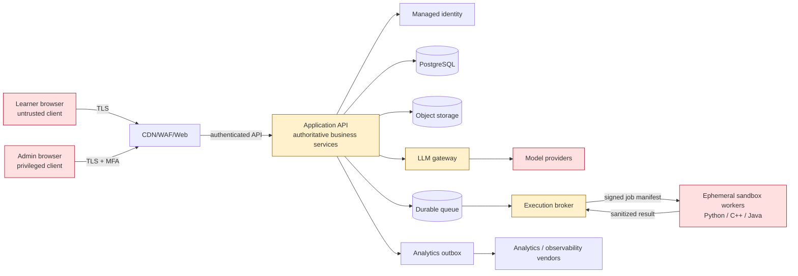

# Socrat V1 threat model

**Status:** Candidate; requires security/privacy owner review  
**Method:** Asset and trust-boundary analysis with STRIDE-style threat enumeration and abuse cases  
**Scope:** V1 web application, APIs, data stores, admin/content tooling, LLM integrations, analytics, and isolated Python/C++/Java execution plane  
**Out of scope:** Native apps, minors, proctoring, employment matching, arbitrary packages/network access, and non-DSA launch content

Threat modeling is continuous. Review this document when a trust boundary, data class, vendor, authentication flow, runtime image, LLM capability, or authoritative decision path changes.

## 1. Security objectives

1. A user can access and change only their own learner data and authorized public content.
2. Untrusted learner code cannot reach application data, secrets, other jobs, host resources, or the network.
3. Practice, tutor, and assessment boundaries preserve hidden tests and independent evidence.
4. Only deterministic, versioned services may write scoring, mastery, curriculum, or release state.
5. Operational failures cannot be misclassified as learner failures.
6. Personal data and sensitive learning artifacts are minimized, purpose-bound, exportable, and deletable.
7. Administrative and content actions are strongly authenticated, least-privileged, and auditable.
8. A compromised external provider is contained by scoped data, credentials, quotas, and kill switches.

## 2. System and trust boundaries

Trust boundaries:

| ID | Boundary | Primary concern |
|---|---|---|
| TB-01 | Internet/client → edge/API | Authentication, injection, abuse, forged state |
| TB-02 | Admin client → privileged APIs | Account takeover, excessive privilege, unsafe content release |
| TB-03 | Application → identity provider | Session/token integrity, enumeration, provider outage |
| TB-04 | Application → primary data/object stores | Authorization, integrity, deletion, backup exposure |
| TB-05 | Application/queue → execution broker | Job forgery, replay, hidden-test disclosure |
| TB-06 | Broker → untrusted sandbox | Escape, egress, resource exhaustion, cross-job leakage |
| TB-07 | Application → LLM gateway/provider | Prompt injection, data disclosure, unsafe/unreliable output |
| TB-08 | Application/outbox → analytics/observability | PII/code/transcript leakage and schema drift |
| TB-09 | Content import → released inventory | Malicious/invalid content, license violation, assessment contamination |

## 3. Assets and data classification

| Class | Examples | Baseline handling |
|---|---|---|
| Restricted | Session secrets, OAuth tokens, signing keys, hidden tests, assessment solutions, admin recovery material | Never sent to client/LLM/analytics; secret manager; narrow service identity; audited access |
| Sensitive personal | Email, account identifiers, time zone, consent, export/deletion request | Encryption in transit/at rest; purpose-limited access; retention/deletion policy |
| Sensitive learning | Code, attempts, tutor transcripts, diagnostic/assessment results, misconceptions, accommodations | Purpose-specific storage; no general analytics payload; learner/admin scoped access |
| Internal | Policy/model/prompt configs, unreleased content, aggregate operations data | Authenticated staff access; version/audit controls |
| Public | Released concept copy, public problem statement where rights allow, public documentation | Integrity/version controls still required |

Data minimization rule: if a downstream service needs a derived flag, ID, or aggregate, do not send raw code, transcript, email, or assessment response.

## 4. Adversaries and misuse actors

- opportunistic unauthenticated attacker;
- malicious or curious learner;
- learner attempting assessment/content extraction;
- compromised learner or admin account;
- malicious code submitted intentionally or accidentally;
- compromised dependency, runtime image, CI credential, or vendor;
- insider with excess access;
- abusive automation causing cost/resource exhaustion;
- content contributor introducing invalid, copied, or poisoned material;
- model/provider producing unsafe, leaking, or fabricated output.

## 5. Risk method

Likelihood and impact are scored 1–5. Inherent risk is `likelihood × impact` before controls.

- Critical: 20–25 — block the affected milestone until reduced and reviewed.
- High: 12–19 — named owner, verification, and mitigation before exposure.
- Medium: 6–11 — scheduled control and monitored residual risk.
- Low: 1–5 — accept explicitly or address through baseline controls.

Scores are prioritization aids, not proof of safety. “Residual” becomes accepted only with test evidence and an accountable human.

## 6. Threat register

| ID | Threat / abuse case | L×I | Required controls | Verification | Owner / due |
|---|---|---:|---|---|---|
| T-001 | Broken object authorization exposes another learner’s goals, code, evidence, or transcript | 4×5=20 | Central ownership policy, opaque IDs, deny-by-default queries, admin separation | Negative API/E2E matrix across every object type | AppSec/API / M1 |
| T-002 | Session theft, token replay, or insecure account recovery | 3×5=15 | Managed auth, secure HttpOnly/SameSite cookies, rotation/revocation, short privileged sessions, no email enumeration | Auth threat tests and provider configuration review | Identity / M1 |
| T-003 | Admin takeover releases malicious content or exports data | 3×5=15 | MFA, least privilege, separate admin roles, step-up for release/export, audit log, break-glass procedure | Role matrix tests and quarterly access review | Security/Ops / M1–M2 |
| T-004 | SQL/template/command injection through client or content input | 3×5=15 | Typed validation, parameterized queries, no shell interpolation, safe rendering/CSP | SAST, DAST, injection corpus | API/Web / M1+ |
| T-005 | CSRF/XSS changes learner state or steals sessions | 3×4=12 | SameSite/CSRF defenses, output encoding, CSP, sanitization, no unsafe content HTML | Browser security tests and DAST | Web / M1+ |
| T-006 | Learner code escapes sandbox into host/control plane | 4×5=20 | Dedicated isolated workers, gVisor-class boundary, non-root, seccomp/cgroups, patched kernel/runtime, no host mounts, disposable nodes | Malicious corpus plus external sandbox review | Execution/Security / M6 |
| T-007 | Learner code reaches network, metadata service, secrets, databases, or other jobs | 4×5=20 | Default-deny egress at host/network layer, no credentials, isolated namespaces, one job/sandbox, metadata blocking | Egress/credential/cross-job adversarial tests | Execution/Security / M6 |
| T-008 | Fork bomb, memory/disk/output exhaustion, zip bomb, or compiler abuse degrades service | 5×4=20 | CPU/wall/memory/PID/disk/output/compile limits, queue quotas, admission control, kill/reap, capacity isolation | Per-runtime resource and 2× beta load/soak tests | Execution/SRE / M6 |
| T-009 | Forged/replayed job or result corrupts scoring | 3×5=15 | Signed immutable job manifest, nonce/idempotency key, pinned image/test hashes, broker-only result channel, expiry | Tamper/replay tests and exact audit reconstruction | Execution/API / M6 |
| T-010 | Hidden tests or assessment solutions leak to browser, logs, LLM, analytics, or worker output | 4×5=20 | Separate storage/roles, server-side evaluation, redaction, no prompt access, sanitized result schema | Network/log/prompt inspection and canary secrets | Assessment/Security / M6–M9 |
| T-011 | Prompt injection in learner code/content manipulates tutor or advisor | 4×4=16 | Treat all context as data, bounded structured prompt, tool allow-list, no state-write tool, candidate envelope, output validation | Adversarial prompt suite per model/prompt | AI/Security / M8 |
| T-012 | Tutor reveals solution early or contaminates independent evidence | 4×4=16 | Mode-aware hint ladder, solution gate, semantic leakage checks, assistance audit, fresh item after exposure | Offline leakage suite and production audit | Learning/AI / M8 |
| T-013 | LLM invents item IDs, prerequisites, scores, or mastery changes | 3×5=15 | Read-only scoped inputs, JSON schema, ID/version allow-list, deterministic revalidation, no direct persistence credentials | Invalid/stale/out-of-envelope contract tests | AI/Planner / M8 |
| T-014 | PII, code, or transcript disclosed to model provider | 3×5=15 | Minimize/redact, provider allow-list, no-training/retention terms where available, purpose flags, kill switch | Payload sampling with synthetic canaries and DPA/config review | Privacy/AI / M8 |
| T-015 | Sensitive fields leak through analytics, logs, errors, traces, or support tools | 4×4=16 | Schema allow-list, structured redaction, separate artifact links, log access control/retention | Automated forbidden-field tests and periodic sampling | Privacy/SRE / M1+ |
| T-016 | Event duplication, reordering, or tampering creates false mastery | 3×5=15 | Append-only evidence, unique event/idempotency keys, transactional outbox, deterministic replay, signed/versioned decisions | Duplicate/reorder/replay property tests | Learner-state/API / M4 |
| T-017 | Policy/config change silently reinterprets historical evidence | 3×5=15 | Immutable versions, shadow scoring, migration decision, before/after calibration, rollback | Golden replay and migration rehearsal | Learning/Data / M4–M5 |
| T-018 | Invalid or poisoned content teaches wrong material or breaks scoring | 4×5=20 | Multi-role review, reference solutions, mutation/boundary tests, immutable release, reports/quarantine, repair workflow | Content release checklist and seeded-defect drills | Content/Learning / M2+ |
| T-019 | Copied/restricted problem creates IP or terms violation | 3×4=12 | Provenance/license fields, similarity review, source allow-list, legal escalation | Rights audit before publish | Content/Product / M2+ |
| T-020 | Practice exposure or near-duplicate contaminates assessment | 4×5=20 | Separate inventories/roles, family IDs, similarity checks, exposure ledger, parallel forms | Contamination simulations and access tests | Assessment/Learning / M9 |
| T-021 | Automated integrity signal falsely accuses learner | 3×4=12 | Signals never auto-declare cheating; evidence hold and human review; appeal path | False-positive fixtures and policy audit | Integrity/Product / M9 |
| T-022 | Deletion/export misses provider, backup, transcript, code, or derived state | 3×5=15 | Data inventory, purpose/retention mapping, provider deletion, tombstone workflow, restore-safe deletion | End-to-end DSAR/delete tests including vendors | Privacy/Data / M10 |
| T-023 | Backup is unreadable, overexposed, or restores deleted/incorrect state | 3×5=15 | Encrypted least-privilege backups, RPO/RTO, restore isolation, deletion reconciliation, audit | Weekly staging restore and access review | SRE/Data / M1+ |
| T-024 | Queue/provider outage causes duplicate score, lost work, or negative evidence | 4×4=16 | Durable queue/outbox, idempotent handlers, explicit delayed states, no-score on uncertainty | Failure injection/game day | SRE/API / M1–M11 |
| T-025 | Dependency/image/CI supply-chain compromise reaches production | 3×5=15 | Lockfiles, review, scanning, SBOM, signed immutable artifacts, protected CI, minimal builders/runtimes | Build provenance verification and scanning gate | Platform/Security / M1+ |
| T-026 | API/bot abuse creates LLM or runner cost denial | 5×4=20 | User/IP/device limits, quotas, queue caps, budget alerts, WAF/anomaly rules, global kill switches | Burst/slow abuse and budget-exhaustion tests | Platform/SRE / M6–M8 |
| T-027 | SSRF through URL/resource import reaches internal services | 3×5=15 | No arbitrary fetch in core app; allow-listed import worker, URL/IP validation, egress proxy, response limits | DNS rebinding/private-range corpus | Content/Platform / M2 |
| T-028 | Accommodation data causes profiling or unfair learner decisions | 3×4=12 | Collect minimum, separate purpose, never lower mastery bar, audit decision features | Feature lineage and fairness review | Privacy/Learning / M3+ |

## 7. Critical abuse-case invariants

- A sandbox has no outbound network and receives no cloud/application credentials, database route, provider key, hidden solution, or learner identity.
- A job result cannot name the score or mastery change; it reports execution facts against a signed manifest.
- A tutor/advisor identity has no permission to mutate goals, content, assessment, evidence, mastery, or policy.
- An admin content reviewer cannot silently alter a released version.
- An analytics outage never blocks a learning transaction; raw sensitive payloads never become the fallback.
- A user-visible success cannot precede durable authoritative persistence.
- A provider outage or uncertain score creates no negative learning evidence.

## 8. Verification program

### M0–M1

- security/privacy owner reviews boundaries, assets, data inventory, and risk acceptance;
- ADRs preserve runner and LLM isolation;
- central authorization and audit contract have negative tests before feature growth;
- dependency/secret/SAST baseline and protected delivery path exist.

### Before sandbox exposure (M6)

- external security review of job protocol and isolation design;
- malicious corpus for file/process/network/kernel/resource/output attacks in every runtime;
- demonstrate no egress, secrets, host mounts, privileged process, cross-job state, or hidden-test output;
- compromise drill proves worker isolation and credential-free containment.

### Before AI canary (M8)

- prompt-injection, schema, hallucinated-ID, stale-version, and leakage suites pass;
- inspect real provider payload shape and retention configuration;
- deterministic fallback, budget limit, and kill switches are exercised.

### Before public launch (M13)

- independent penetration test findings resolved or formally accepted;
- DSAR/export/delete and backup-restore interactions verified;
- admin access review, incident runbooks, contacts, and on-call ready;
- incident exercises cover account takeover, runner compromise, content defect, assessment leak, model leak, and vendor outage.

## 9. Privacy/legal decisions still requiring accountable review

M0 must record, before the pilot or vendor use:

- operating entity and privacy contact/controller;
- launch jurisdictions and applicable legal review;
- consent/notice wording and lawful processing basis where applicable;
- retention schedules for accounts, code, evidence, transcripts, logs, backups, and pilot recordings;
- vendor list, regions, subprocessors, DPAs, model-training/retention settings;
- incident notification process;
- handling of deletion requests across immutable audit and backups;
- whether accommodations or inferred learning state receive any special treatment.

This document is an engineering risk model, not legal advice or evidence of regulatory compliance.

## 10. Review triggers

Re-open the threat model when adding a language/runtime, package installation, network access, a new identity/provider, mobile client, minors, proctoring, external profile ingestion, public credentials, B2B tenant boundary, or any LLM write/tool capability.
